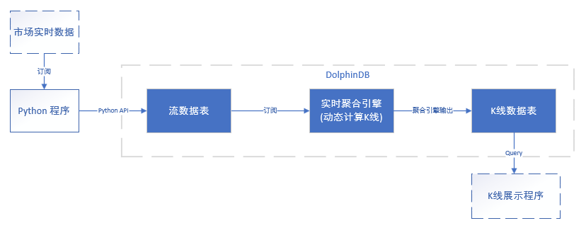

# Python API for DolphinDB

不同操作系统对应 API 支持的 Python 版本号：

| 操作系统      | Python 版本号                        |
| :------------ | :--------------------------------------- |
| Windows(amd64)| Python 3.6-3.10                           |
| Linux(x86_64) | Python 3.6-3.10                           |
| Linux(aarch64)| Conda 环境下的 Python 3.7-3.10            |
| Mac(x86_64)   | Conda 环境下的 Python 3.6-3.10            |
| Mac(arm64)    | Conda 环境下的 Python 3.8-3.10            |

注意：DolphinDB Python API 需要以下依赖库：future, NumPy 和 pandas。其中 NumPy 版本号范围为1.18~1.23.4，pandas 版本号须不小 0.25.1（1.3.0 不支持）。

通过如下指令进行安装：

```Console
$ pip install dolphindb
```
若安装失败，或安装成功后无法导入 dolphindb 包，可尝试通过以下方法解决：

1. 通过 [PyPI](https://pypi.org/) 确认是否存在支持当前操作系统（例如Linux arm架构、Mac M1等）的 DolphinDB API 安装包。若存在，则将该 whl 包下载至本地。
2. 通过如下命令查看适合当前系统环境支持的 whl 包后缀。
   ```
   pip debug --verbose
   ```
3. 根据 Compatible tags 的显示信息，将 DolphinDB 的 whl 包名修改为适合系统架构的名称。以 Mac(x86_64) 系统为例：安装包名为“dolphindb-1.30.19.2-cp37-cp37m-macosx_10_16_x86_64.whl”。但查询到 pip 支持的当前系统版本为10.13，则使用“10_13”替换 whl 包名中的“10_16”。
4. 尝试安装更名后的 whl 包。

若执行完上述操作后，仍无法安装或导入，可在 [DolphinDB 社区](https://ask.dolphindb.net)中进行反馈。

本教程目录如下：

- [Python API for DolphinDB](#python-api-for-dolphindb)
  - [1 运行 DolphinDB 脚本及调用函数](#1-运行-dolphindb-脚本及调用函数)
    - [1.1 建立 DolphinDB 连接](#11-建立-dolphindb-连接)
    - [1.2 运行 DolphinDB 脚本](#12-运行-dolphindb-脚本)
    - [1.3 运行 DolphinDB 函数](#13-运行-dolphindb-函数)
    - [1.5 查询完毕后自动清除变量](#15-查询完毕后自动清除变量)
  - [2 上传本地对象到 DolphinDB 服务器](#2-上传本地对象到-dolphindb-服务器)
    - [2.1 使用 Session 的 upload 方法上传](#21-使用-session-的-upload-方法上传)
    - [2.2 使用 `table` 方法上传](#22-使用-table-方法上传)
    - [2.3 上传的数据表的生命周期](#23-上传的数据表的生命周期)
  - [3 创建 DolphinDB 数据库以及分区表](#3-创建-dolphindb-数据库以及分区表)
    - [3.1 使用 DolphinDB Python API 的原生方法](#31-使用-dolphindb-python-api-的原生方法)
    - [3.2 使用 `run` 方法创建](#32-使用-run-方法创建)
  - [4 导入数据到 DolphinDB 数据库](#4-导入数据到-dolphindb-数据库)
    - [4.1 导入内存表](#41-导入内存表)
    - [4.2 导入 DFS 分区表](#42-导入-dfs-分区表)
    - [4.3 导入内存分区表](#43-导入内存分区表)
  - [5 从 DolphinDB 数据库中加载数据](#5-从-dolphindb-数据库中加载数据)
    - [5.1 使用 `loadTable` 函数](#51-使用-loadtable-函数)
    - [5.2 使用 `loadTableBySQL` 函数](#52-使用-loadtablebysql-函数)
    - [5.3 支持分段读取数据库表](#53-支持分段读取数据库表)
    - [5.4 从 DolphinDB 下载数据到 Python 时的数据转换](#54-从-dolphindb-下载数据到-python-时的数据转换)
    - [5.5 数据格式协议 protocol](#55-数据格式协议-protocol)
  - [6 追加数据到 DolphinDB 数据表](#6-追加数据到-dolphindb-数据表)
    - [6.1 使用 `tableInsert` 函数追加多个 List 到内存表](#61-使用-tableinsert-函数追加多个-list-到内存表)
    - [6.2 使用 `tableInsert` 函数追加 DataFrame 到内存表](#62-使用-tableinsert-函数追加-dataframe-到内存表)
    - [6.3 使用 `insert into` 语句追加数据到内存表](#63-使用-insert-into-语句追加数据到内存表)
    - [6.4 使用 `tableAppender` 对象追加数据时自动转换时间类型](#64-使用-tableappender-对象追加数据时自动转换时间类型)
    - [6.5 使用 tableUpsert 对象追加数据](#65-使用-tableupsert-对象追加数据)
    - [6.6 追加数据到分布式表](#66-追加数据到分布式表)
    - [6.7 异步追加数据](#67-异步追加数据)
    - [6.8 批量异步追加数据](#68-批量异步追加数据)
    - [6.9 从 Python 上传数据到 DolphinDB 时的数据转换](#69-从-python-上传数据到-dolphindb-时的数据转换)
  - [7 多线程调用线程池对象](#7-多线程调用线程池对象)
  - [8 数据库和表操作](#8-数据库和表操作)
    - [8.1 数据库和表的操作方法说明](#81-数据库和表的操作方法说明)
    - [8.2 数据库操作](#82-数据库操作)
    - [8.3 表操作](#83-表操作)
    - [8.3.3 更新表](#833-更新表)
  - [9 SQL 查询](#9-sql-查询)
    - [9.1 `select`](#91-select)
    - [9.2 `exec`](#92-exec)
    - [9.3 `top` \& `limit`](#93-top--limit)
    - [9.4 `where`](#94-where)
    - [9.5 `groupby`](#95-groupby)
    - [9.6 `contextby`](#96-contextby)
    - [9.7 pivotby](#97-pivotby)
    - [9.8 表连接](#98-表连接)
    - [9.9 `executeAs`](#99-executeas)
    - [9.10 回归运算](#910-回归运算)
  - [10 Python Streaming API](#10-python-streaming-api)
    - [10.1 指定订阅端口号](#101-指定订阅端口号)
    - [10.2 订阅与反订阅](#102-订阅与反订阅)
    - [10.3 订阅异构流表](#103-订阅异构流表)
    - [10.4 流数据应用](#104-流数据应用)
  - [11 更多实例](#11-更多实例)
    - [11.1 动量交易策略](#111-动量交易策略)
    - [11.2 时间序列计算](#112-时间序列计算)
  - [12 常见问题](#12-常见问题)
  - [13 DolphinDB 空值处理规则](#13-dolphindb-空值处理规则)
  - [14 其它功能](#14-其它功能)
    - [14.1 强制终止进程](#141-强制终止进程)
    - [14.2 设置 TCP 连接超时时间](#142-设置-tcp-连接超时时间)

## 1 运行 DolphinDB 脚本及调用函数

### 1.1 建立 DolphinDB 连接

Python 应用通过会话（Session）在 DolphinDB 服务器上执行脚本和函数，以及在两者之间双向传递数据。其接口如下：

```
session(host=None, port=None, userid="", password="", enableSSL=False, enableASYNC=False, keepAliveTime=30, enableChunkGranularityConfig=False, compress=False, enablePickle=True, python=False)
```

常用的 Session 类的函数如下：

| 方法名                                      | 详情                                       |
| :--------------------------------------- | :--------------------------------------- |
| connect(host,port,[username,password, startup, highAvailability, highAvailabilitySites, keepAliveTime, reconnect]) | 将会话连接到 DolphinDB 服务器                     |
| login(username,password,[enableEncryption=True]) | 登录服务器                                    |
| run(DolphinDBScript)                     | 将脚本在 DolphinDB 服务器运行                     |
| run(DolphinDBFunctionName,args)          | 调用 DolphinDB 服务器上的函数                     |
| runFile(filePath)                        | 将本地的 DolphinDB 脚本文件传到服务器运行。请注意，对于Linux 系统，文件需使用 UTF-8 编码，对于 windows 系统，文件需使用 ASCII 编码 |
| upload(DictionaryOfPythonObjects)        | 将本地数据对象上传到 DolphinDB 服务器                 |
| undef(objName,objType)                   | 取消指定对象在 DolphinDB 内存中定义以释放内存             |
| undefAll()                               | 取消所有对象在 DolphinDB 内存中的定义以释放内存            |
| getSessionId()                           | 获取当前 session 对象的 session id              |
| close()                                  | 关闭当前会话                                   |

以下脚本中，通过 import 语句导入 API 以后，在 Python 中创建一个会话，然后使用指定的域名或 IP 地址和端口号把该会话连接到 DolphinDB 服务器。

请注意以下两点：
* 建立连接前，需要先启动 DolphinDB 服务器。
* 若当前 session 不再使用，Python 会自动释放连接，但存在延时，可以调用 `close()` 立即关闭会话。否则可能出现因连接数过多，导致其它会话无法连接服务器的问题。

```python
import dolphindb as ddb
s = ddb.session()
s.connect("localhost", 8848)
# output
True

s.close()   # 关闭会话
```

#### connect <!-- omit in toc -->

```
connect(host,port,[userid=None,password=None, startup=None, highAvailability=False, highAvailabilitySites=None, keepAliveTime=None, reconnect=False])
```

* **host / port**：所连接的服务器的地址和端口。
* **userid / password**：登录时的用户名密码。
* **startup**：启动脚本，可以用于执行一些预加载任务。它可以包含加载插件、加载分布式表、定义并加载流数据表等脚本。
* **highAvailability / highAvailabilitySites**：API 高可用相关配置参数。若要开启 API 高可用，则需要指定 *highAvailability* 参数为 True，*highAvailabilitySites* 里指定所有可用节点的 `ip:port`。
* **keepAliveTime**：通过配置 *keepAliveTime* 参数可以设置 TCP 的存活检测机制的检测时长，从而能够在网络不稳定条件下，及时释放半打开的 TCP 连接。默认值为30秒。
* **reconnect**：该参数仅在指定 *highAvailability* = False 时有效。若设置 *reconnect* = True，则 API 在检测到连接异常时，会尝试进行重连。

高可用模式下通过单线程方式创建多个 session 时，Python API 保证了所有可用节点上连接的负载均衡。多线程方式同时创建多个 session 时，不能保证连接的负载均衡。

高可用模式下通过单线程方式创建多个 session 时，Python API 保证了所有可用节点上连接的负载均衡。多线程方式同时创建多个 session 时，因为服务器响应存在时间差，不能保证连接的负载均衡。

如果需要使用用户名和密码连接，可使用以下脚本。其中 "admin" 为 DolphinDB 默认的管理员用户名，"123456" 为密码。

```python
s.connect("localhost", 8848, "admin", "123456")
```

或者

```python
s.connect("localhost", 8848)
s.login("admin","123456")
```
若需要开启 API 高可用，则需要指定高可用组内所有数据节点的 IP 地址，示例如下：

```python
import dolphindb as ddb

s = ddb.session()
sites=["192.168.1.2:24120", "192.168.1.3:24120", "192.168.1.4:24120"]
s.connect(host="192.168.1.2", port=24120, userid="admin", password="123456", highAvailability=True, highAvailabilitySites=sites)
```

若会话过期，或者初始化会话时没有指定登录信息（用户名与密码），可使用 `login` 函数来登录服务器。默认在连接时对用户名与密码进行加密传输

会话连接后，调用 `getSessionId` 函数可以获取当前会话对象的 session id。

```python
import dolphindb as ddb
s = ddb.session()
s.connect("localhost", 8848)
print(s.getSessionId())
```

#### SSL（加密）模式 <!-- omit in toc -->

server 1.10.17 与 1.20.6 版本之后创建会话时，支持加密通讯参数 *enableSSL*，默认值为 False。

可使用以下脚本启动 SSL 通讯。server 端同时需要添加 enableHTTPS=true 配置项。

```
s=ddb.session(enableSSL=True)
```

#### 异步模式 <!-- omit in toc -->

server 1.10.17, 1.20.6 版本之后开始支持异步通讯参数 *enableASYNC*，默认值为 False。

可使用以下脚本启动异步通讯。异步通讯的情况下，与 server 端的通讯只能通过 `session.run` 方法，并且无返回值。这种模式非常适用于异步写入数据，节省了 API 端检测返回值的时间。

```
s=ddb.session(enableASYNC=True)
```

#### 压缩模式 <!-- omit in toc -->

server 1.30.6 版本之后开始支持压缩参数 *compress*，默认值为 False。

可使用以下脚本启用压缩通讯。这种模式非常适用于大数据量的写入或查询。将数据压缩后传输，可以节省网络带宽，但会增加服务器和 API 端的计算量。注意，开启压缩时需要关闭 pickle 功能。

```
s=ddb.session(compress=True, enablePickle=False)
```

### 1.2 运行 DolphinDB 脚本

DolphinDB 脚本都可以通过 `run(script)` 方法来运行。如果脚本在 DolphinDB 中返回对象，会转换成 Python 中对象。脚本运行失败的话，会有相应的错误提示。

```python
s = ddb.session()
s.connect("localhost", 8848)
a=s.run("`IBM`GOOG`YHOO")
repr(a)

# output
"array(['IBM','GOOG','YHOO'], dtype=object)"
```

使用 `run` 方法可生成自定义函数：

```python
s.run("def getTypeStr(input){ \nreturn typestr(input)\n}")
```

对多行脚本，可以采用三引号的方式将其格式化，这样更易于维护。例如：

```
script="""
def getTypeStr(input){
    return typestr(input)
}
"""
s.run(script)
s.run("getTypeStr", 1)

# output
'LONG'
```

### 1.3 运行 DolphinDB 函数

除了运行脚本之外，`run` 命令可以直接在远程 DolphinDB 服务器上执行 DolphinDB 内置或用户自定义函数。对这种用法，`run` 方法的第一个参数是 DolphinDB 中的函数名，之后的参数是该函数的参数。

#### 1.3.1 传参 <!-- omit in toc -->

下面的示例展示 Python 程序通过 `run` 调用 DolphinDB 内置的 `add` 函数。`add` 函数有 x 和 y 两个参数。根据参数是否已在 DolphinDB server 端被赋值，有以下三种调用方式：

- 所有参数均已在 DolphinDB server 端被赋值

若变量 x 和 y 已经通过 Python 程序在 DolphinDB server 端被赋值，

```python
s.run("x = [1,3,5];y = [2,4,6]")
```

那么在 Python 端要对这两个向量做加法运算，只需直接使用 `run(script)` 即可：

```python
a=s.run("add(x,y)")
repr(a)

# output
array([3, 7, 11], dtype=int32)
```

- 仅有一个参数 DolphinDB server 端被赋值

若仅变量 x 已通过 Python 程序在服务器端被赋值：

```python
s.run("x = [1,3,5]")
```

而参数 y 要在调用 `add` 函数时一并赋值，需要使用 “部分应用” 方式把参数 x 固化在 `add` 函数内。具体请参考 [部分应用文档](https://www.dolphindb.cn/cn/help/Functionalprogramming/PartialApplication.html)。

```python
import numpy as np

y=np.array([1,2,3])
result=s.run("add{x,}", y)
repr(result)
# output
'array([2,5,8])'

result.dtype
# output
dtype('int64')
```

- 两个参数都待由 Python 客户端赋值

```python
import numpy as np

x=np.array([1.5,2.5,7])
y=np.array([8.5,7.5,3])
result=s.run("add", x, y)
repr(result)
# output
'array([10., 10., 10.])'

result.dtype
# output
dtype('float64')
```

#### 1.3.2 参数支持的数据类型与数据结构 <!-- omit in toc -->

通过 `run` 调用 DolphinDB 的内置函数时，客户端上传参数的数据结构可以是标量 (scalar)，列表 (list)，字典 (dict)，NumPy 的对象，pandas 的 DataFrame 和 Series 等等。

> 需要注意：
> 
> 1. NumPy array 的维度不能超过 2。
> 2. pandas 的 DataFrame 和 Series 若有 index，在上传到 DolphinDB 以后会丢失。如果需要保留 index 列，则需要使用 pandas 的 DataFrame 函数 reset_index。
> 3. 如果 DolphinDB 函数的参数是时间或日期类型，Python 客户端上传时，参数应该先转换为 numpy.datetime64 类型。

下面具体介绍不同的 Python 对象作为参数参与运算的例子。

- 将 list 对象作为参数

  使用 DolphinDB 的 `add` 函数对两个 Python 的 list 进行相加：
  
```python
  s.run("add",[1,2,3,4],[1,2,1,1])
  # output
  array([2, 4, 4, 5])
```

- 将 NumPy 对象作为参数

  除了 NumPy 的 array 对象之外，NumPy 的数值型标量也可以作为参数参与运算，例如，将 np.int 或 np.datetime64 等对象上传到 DolphinDB 作为函数参数。

  - np.int 作为参数
  
    ```python
    import numpy as np
    s.run("add{1,}",np.int(4))
    # output
    5
    ```

  - np.datetime64 作为参数

    Python API 将 datetime64 格式的数据转换成 DolphinDB 中对应的时间数据类型。对应关系如下表。

    | datetime64                      | DolphinDB Type |
    | :------------------------------ | :------------- |
    | '2019-01-01'                    | DATE           |
    | '2019-01'                       | MONTH          |
    | '2019-01-01T20:01:01'           | DATETIME       |
    | '2019-01-01T20:01:01.122'       | TIMESTAMP      |
    | '2019-01-01T20:01:01.122346100' | NANOTIMESTAMP  |

    ```python
    import numpy as np
    s.run("typestr",np.datetime64('2019-01-01'))
    # output
    'DATE'

    s.run("typestr",np.datetime64('2019-01'))
    # output
    'MONTH'

    s.run("typestr",np.datetime64('2019-01-01T20:01:01'))
    # output
    'DATETIME'

    s.run("typestr",np.datetime64('2019-01-01T20:01:01.122'))
    # output
    'TIMESTAMP'

    s.run("typestr",np.datetime64('2019-01-01T20:01:01.1223461'))
    # output
    'NANOTIMESTAMP'
    ```

    由于 DolphinDB 中的 TIME, MINUTE, SECOND, NANOTIME 等类型没有日期信息，datetime64 类型无法由 Python API 直接转换为这些类型。若需要根据 Python 中数据在 DolphinDB 中产生这些类型数据，可先将 datetime64 类型数据上传到 DolphinDB Server，然后去除日期信息。上传数据方法可参见 [上传本地对象到 DolphinDB 服务器](#2-上传本地对象到-dolphindb-服务器)。

    ```python
    import numpy as np
    ts = np.datetime64('2019-01-01T20:01:01.1223461')
    s.upload({'ts':ts})
    s.run('a=nanotime(ts)')

    s.run('typestr(a)')
    # output
    'NANOTIME'

    s.run('a')
    # output
    np.datetime64('1970-01-01T20:01:01.122346100')
    ```

    请注意，在上例最后一步中，将 DolphinDB 中的 NANOTIME 类型返回 Python 时，Python 会自动添加 1970-01-01 作为日期部分。

  - np.datetime64 对象的 list 作为参数

    ```python
    import numpy as np
    a=[np.datetime64('2019-01-01T20:00:00.000000001'), np.datetime64('2019-01-01T20:00:00.000000001')]
    s.run("add{1,}",a)
    # output
    array(['2019-01-01T20:00:00.000000002', '2019-01-01T20:00:00.000000002'], dtype='datetime64[ns]')
    ```

- 将 pandas 的对象作为参数

  pandas 的 DataFrame 和 Series 若有 index，在上传到 DolphinDB 后会丢失。

  - Series 作为参数：
  
    ```python
    import pandas as pd
    import numpy as np
    a = pd.Series([1,2,3,1,5],index=np.arange(1,6,1))
    s.run("add{1,}",a)
    # output
    array([2, 3, 4, 2, 6])
    ```

  - DataFrame 作为参数

    ```python
    import pandas as pd
    import numpy as np
    a = pd.DataFrame({'id': np.int32([1, 4, 3, 2, 3]),
        'date': np.array(['2019-02-03','2019-02-04','2019-02-05','2019-02-06','2019-02-07'], dtype='datetime64[D]'),
        'value': np.double([7.8, 4.6, 5.1, 9.6, 0.1]),},
        index=['one', 'two', 'three', 'four', 'five'])
    
    s.upload({'a':a})
    s.run("typestr",a)
    # output
    'IN-MEMORY TABLE'
    
    s.run('a')
    # output
       id date        value
    0  1  2019-02-03  7.8
    1  4  2019-02-04  4.6
    2  3  2019-02-05  5.1
    3  2  2019-02-06  9.6
    4  3  2019-02-07  0.1
    ```

### 1.4 Session 方法 `undef` 与内存释放的关系 <!-- omit in toc -->

`undef` 方法释放 session 中的指定对象；`undefAll` 方法释放 session 中的全部对象。`undef` 支持的对象类型包括："VAR"(变量)、"SHARED"(共享变量) 与 "DEF"(函数定义)。默认类型为变量 "VAR"。"SHARED" 指内存中跨 session 的共享变量，例如流数据表。

假设 session 中有一个 DolphinDB 的表对象 t1，可以通过 `session.undef("t1","VAR")` 将该表释放掉。释放后，并不一定能够看到内存马上释放。这与 DolphinDB 的内存管理机制有关。DolphinDB 从操作系统申请的内存，释放后不会立即还给操作系统，因为这些释放的内存在 DolphinDB 中可以立即使用。申请内存首先从 DolphinDB 内部的池中申请内存，不足才会向操作系统去申请。配置文件 (dolphindb.cfg) 中参数 *maxMemSize* 设置的内存上限会尽量保证。譬如说设置为 8GB，那么 DolphinDB 会尽可能利用 8GB 内存。所以如果用户需要反复 undef 内存中的一个变量以释放内存，为后面程序腾出更多内存空间，则需要将 *maxMemSize* 调整到一个合理的数值，否则当前内存没有释放，而后面需要的内存超过了系统的最大内存，DolphinDB 的进程就有可能被操作系统杀掉或者出现 out of memory 的错误。

### 1.5 查询完毕后自动清除变量

使用 `run` 方法时，有时候希望 server 能在执行完毕后，自动释放 `run` 语句中创建的变量，以减少内存占用。这可以通过指定 session 以及 DBConnectionPool 对象的 `run` 方法的参数 `clearMemory=True` 来实现。

**注意**: session 对象的 `run` 方法默认  `clearMemory=False`，而 DBConnectionPool 对象的 `run` 方法默认 `clearMemory=True`。

```python
s = ddb.session()
s.connect("localhost", 8848, "admin", "123456")
s.run("t=1", clearMemory = True)
s.run("t")
```

由于 t 在倒数第二行执行完毕后就被清除了，所以最后一行脚本会抛出异常：

```
<Exception> in run: Syntax Error: [line #1] Cannot recognize the token t
```

## 2 上传本地对象到 DolphinDB 服务器

若需要在 DolphinDB 中重复调用一个本地 Python 对象变量，可将本地对象上传到 DolphinDB 服务器。上传时需要指定 DolphinDB 中变量名，以用于之后重复调用。

如果一个表对象只是一次性使用，尽量不要使用上传机制，可以直接通过函数调用来完成，将表对象作为函数的一个参数。原因请见 2.3 小节。

### 2.1 使用 Session 的 upload 方法上传

Python API 提供 upload 方法将 Python 对象上传到 DolphinDB 服务器。upload 方法输入一个 Python 的字典对象，它的 key 对应的是 DolphinDB 中的变量名，value 对应的是 Python 对象，可为 Numbers，Strings，Lists，DataFrame 等数据对象。

- 上传 Python list

```python
a = [1,2,3.0]
s.upload({'a':a})
a_new = s.run("a")
print(a_new)
# output
[1, 2, 3.0]

a_type = s.run("typestr(a)")
print(a_type)
# output
ANY VECTOR
```

注意，Python 中像 a=[1,2,3.0] 这样含有不同数据类型的 list，上传到 DolphinDB 后，会被识别为元组（any vector）。这种情况下，建议使用 np.array 代替 list，即通过 `a=np.array([1,2,3.0],dtype=np.double)` 指定统一的数据类型，这样上传 a 以后，a 会被识别为 double 类型的向量。

- 上传 NumPy array

```python
import numpy as np

arr = np.array([1,2,3.0],dtype=np.double)
s.upload({'arr':arr})
arr_new = s.run("arr")
print(arr_new)
# output
[1. 2. 3.]

arr_type = s.run("typestr(arr)")
print(arr_type)
# output
FAST DOUBLE VECTOR
```

- 上传 pandas DataFrame

```python
import pandas as pd
import numpy as np

df = pd.DataFrame({'id': np.int32([1, 2, 3, 6, 8]), 'x': np.int32([5, 4, 3, 2, 1])})
s.upload({'t1': df})
print(s.run("t1.x.avg()"))
# output
3.0
```
请注意，通过 upload 上传 DataFrame 到 DolphinDB 时，每列数据需要具有相同的的数据类型。

### 2.2 使用 `table` 方法上传

在 Python 中可使用 `table` 方法创建 DolphinDB 表对象，并上传到 server 端。table 方法的输入可以是字典、DataFrame 或 DolphinDB 中的表名。

* 上传 dict

下面的程序定义了一个函数 `createDemoDict()` 以创建一个字典。

```python
import numpy as np

def createDemoDict():
    return {'id': [1, 2, 2, 3],
            'date': np.array(['2021-05-06', '2021-05-07', '2021-05-06', '2021-05-07'], dtype='datetime64[D]'),
            'ticker': ['AAPL', 'AAPL', 'AMZN', 'AMZN'],
            'price': [129.74, 130.21, 3306.37, 3291.61]}
```

调用 `table` 方法将该字典上传到 DolphinDB server 端，并将该表命名为 "testDict"，再通过 API 提供的 `loadTable` 函数读取和查看表内数据。

```python
import numpy as np

# save the table to DolphinDB server as table "testDict"
dt = s.table(data=createDemoDict(), tableAliasName="testDict")

# load table "testDict" on DolphinDB server
print(s.loadTable("testDict").toDF())

# output
   id       date ticker    price
0   1 2021-05-06   AAPL   129.74
1   2 2021-05-07   AAPL   130.21
2   2 2021-05-06   AMZN  3306.37
3   3 2021-05-07   AMZN  3291.61
```

* 上传 pandas DataFrame
  
例1.

以下程序定义函数 `createDemoDataFrame()`，以创建一个 pandas 的 DataFrame 对象。

```python
import pandas as pd

def createDemoDataFrame():
    data = {'cid': np.array([1, 2, 3], dtype=np.int32),
            'cbool': np.array([True, False, np.nan], dtype=np.bool),
            'cchar': np.array([1, 2, 3], dtype=np.int8),
            'cshort': np.array([1, 2, 3], dtype=np.int16),
            'cint': np.array([1, 2, 3], dtype=np.int32),
            'clong': np.array([0, 1, 2], dtype=np.int64),
            'cdate': np.array(['2019-02-04', '2019-02-05', ''], dtype='datetime64[D]'),
            'cmonth': np.array(['2019-01', '2019-02', ''], dtype='datetime64[M]'),
            'ctime': np.array(['2019-01-01 15:00:00.706', '2019-01-01 15:30:00.706', ''], dtype='datetime64[ms]'),
            'cminute': np.array(['2019-01-01 15:25', '2019-01-01 15:30', ''], dtype='datetime64[m]'),
            'csecond': np.array(['2019-01-01 15:00:30', '2019-01-01 15:30:33', ''], dtype='datetime64[s]'),
            'cdatetime': np.array(['2019-01-01 15:00:30', '2019-01-02 15:30:33', ''], dtype='datetime64[s]'),
            'ctimestamp': np.array(['2019-01-01 15:00:00.706', '2019-01-01 15:30:00.706', ''], dtype='datetime64[ms]'),
            'cnanotime': np.array(['2019-01-01 15:00:00.80706', '2019-01-01 15:30:00.80706', ''], dtype='datetime64[ns]'),
            'cnanotimestamp': np.array(['2019-01-01 15:00:00.80706', '2019-01-01 15:30:00.80706', ''], dtype='datetime64[ns]'),
            'cfloat': np.array([2.1, 2.658956, np.NaN], dtype=np.float32),
            'cdouble': np.array([0., 47.456213, np.NaN], dtype=np.float64),
            'csymbol': np.array(['A', 'B', '']),
            'cstring': np.array(['abc', 'def', ''])}
    return pd.DataFrame(data)
```

调用 `table` 方法将该 DataFrame 上传到 DolphinDB server 端，命名为 "testDataFrame"，再通过 API 提供的 `loadTable` 函数读取和查看表内数据。

```python
dt = s.table(data=createDemoDataFrame(), tableAliasName="testDataFrame")
print(s.loadTable("testDataFrame").toDF())
```

```
# output
   cid  cbool  cchar  cshort  cint  ...             cnanotimestamp    cfloat    cdouble csymbol cstring
0    1   True      1       1     1  ... 2019-01-01 15:00:00.807060  2.100000   0.000000       A     abc
1    2  False      2       2     2  ... 2019-01-01 15:30:00.807060  2.658956  47.456213       B     def
2    3   True      3       3     3  ...                        NaT       NaN        NaN
```

例2. 使用 `table` 方法，创建包含 array vector 类型字段的表并上传到服务器。

```python
import numpy as np
import pandas as pd
import dolphindb as ddb
s = ddb.session()
s.connect("localhost", 8848, "admin", "123456")
df = pd.DataFrame({
                'value': [np.array([1,2,3,4,5,6,7,8,9],dtype=np.int64),np.array([11,12,13,14],dtype=np.int64),np.array([22,13,11,12,13,14],dtype=np.int64)]
        })
tmp = s.table(data=df, tableAliasName="testArrayVector")

print(s.loadTable("testArrayVector").toDF())

# output
                         value
0  [1, 2, 3, 4, 5, 6, 7, 8, 9]
1             [11, 12, 13, 14]
2     [22, 13, 11, 12, 13, 14]
```

### 2.3 上传的数据表的生命周期

`table` 和 `loadTable` 函数返回一个 Python 本地变量。下例中，server 端表对象 t1 对应的 Python 本地变量为 t0：

```python
t0=s.table(data=createDemoDict(), tableAliasName="t1")
```

释放 server 端对象有三种方法：

- `undef` 方法
  
```python
s.undef("t1", "VAR")
```

- 将 server 端对象置空

```python
s.run("t1=NULL")
```

- 取消本地变量对 server 端对象的引用

```python
t0=None
```

Python 端通过 session.table 函数将数据上传到 server 之后，DolphinDB 会建立一个 Python 端变量对 server 端 table 变量的引用。当 Python 端对 server 端 table 变量引用消失后，server 端的 table 会自动释放。

以下代码将一个表上传到 server，然后通过 toDF() 下载数据。

```python
t1=s.table(data=createDemoDict(), tableAliasName="t1")
print(t1.toDF())

#output
   id       date ticker    price
0   1 2021-05-06   AAPL   129.74
1   2 2021-05-07   AAPL   130.21
2   2 2021-05-06   AMZN  3306.37
3   3 2021-05-07   AMZN  3291.61
```

<!---
如果重复执行以上语句，会发生找到不到 t1 的异常。原因是上传结束后，在重新给 Python 端 t1 分配 DolphinDB 的表对象前，Python 端会取消对 server 端表 t1 的原有引用，DolphinDB 端会对 session 中的对应的表 t1 进行释放（通过函数 `undef` 取消它在 session 中的定义），所以会出现无法找到 t1 的异常。
```python
t1=s.table(data=createDemoDict(), tableAliasName="t1")
print(t1.toDF())

#output
<Server Exception> in run: Can't find the object with name t1
```

若要避免这种情况，可将这个 table 对象赋值给另一个 Python 本地变量，但代价是 server 端保存了两份同样的 table 对象，因为 Python 端有两个引用：t1 和 t2。
```python
t2=s.table(data=createDemoDict(), tableAliasName="t1")
print(t2.toDF())

#output
        date ticker    price
0 2021-05-06   AAPL   129.74
1 2021-05-07   AAPL   130.21
2 2021-05-06   AMZN  3306.37
3 2021-05-07   AMZN  3291.61
```

如果需要反复通过同一个本地变量 t1 指向相同的或者不同的上传表，建议不指定 DolphinDB 表名。此时会为用户随机产生一个临时表名。这个表名可以通过 t1.tableName() 来获取。那么 server 端是不是会产生很多表对象，造成内存溢出呢？由于 Python 端使用了同一个变量名，所以在重新上传数据的时候，系统会将上一个表对象释放掉 (TMP_TBL_876e0ce5)，而用一个新的 table 对象 TMP_TBL_4c5647af 来对应 Python 端的 t1，所以 server 端始终只有一个对应的表对象。
```python
t1=s.table(data=createDemoDict())
print(t1.tableName())

#output
TMP_TBL_876e0ce5

print(t1.toDF())

#output
        date ticker    price
0 2021-05-06   AAPL   129.74
1 2021-05-07   AAPL   130.21
2 2021-05-06   AMZN  3306.37
3 2021-05-07   AMZN  3291.61

t1=s.table(data=createDemoDict())
print(t1.tableName())

#output
'TMP_TBL_4c5647af'

print(t1.toDF())

#output
        date ticker    price
0 2021-05-06   AAPL   129.74
1 2021-05-07   AAPL   130.21
2 2021-05-06   AMZN  3306.37
3 2021-05-07   AMZN  3291.61
```

 --->

同理，通过 Python API 加载一个 DFS 分区表到内存，也会建立一个 Python 本地变量与 DolphinDB server 端内存表一一对应的关系。

在 DolphinDB 中运行以下脚本：

```
db = database("dfs://testdb",RANGE, [1, 5 ,11])
t1=table(1..10 as id, 1..10 as v)
db.createPartitionedTable(t1,`t1,`id).append!(t1)

```

然后在 Python 中运行以下脚本:

```python
pt1=s.loadTable(tableName='t1',dbPath="dfs://testdb")
```

以上脚本在 server 端创建了一个 DFS 分区表，然后通过 session 函数 `loadTable` 来将该表导入内存，并将该表对象赋给本地变量 pt1。注意到这里 t1 并不是 server 端表对象名，而是 DFS 分区表名。server 端表对象名需要通过执行 pt1.tableName() 来得到。

```python
print(pt1.tableName())
'TMP_TBL_4c5647af'
```

如果一个表对象只是一次性使用，尽量不要使用上传机制，可以直接通过函数调用来完成，将表对象作为函数的一个参数。函数调用不会缓存数据。函数调用结束后，所有数据都释放，而且只有一次网络传输，降低网络延迟。

## 3 创建 DolphinDB 数据库以及分区表

Python API 中，通过 s.database 在 DolphinDB 中创建数据库，返回一个 Database 类的实例化对象。使用 Database 类的如下两种方法，便可通过 Python 脚本在 DolphinDB 中创建分区表：

| 方法名                                                   |详情                                                                    |
|----------------------------------------------------------|------------------------------------------------------------------------|
|createTable(table, tableName, sortColumns=None)           |在分布式数据库中创建一个维度表（未分区）。返回一个 Table 表对象。<br>维度表适用于存储不频繁更新的小数据集。|
|createPartitionedTable(table, tableName, partitionColumns, compressMethods={}, sortColumns=None, keepDuplicates=None, sortKeyMappingFunction=None)|在分布式数据库中创建一个分区表。返回一个 Table 表对象。 |

可以使用 DolphinDB Python API 的原生方法或 `run` 方法，创建 DolphinDB 数据库。本章将分别介绍两种建库及各种建表方法。

### 3.1 使用 DolphinDB Python API 的原生方法

准备环境

```python
import numpy as np
import pandas as pd
import dolphindb.settings as keys
```

#### 3.1.1 创建基于 VALUE 分区的数据库及数据表 <!-- omit in toc -->

按 date 分区：

```python
dbPath="dfs://db_value_date"
if s.existsDatabase(dbPath):
    s.dropDatabase(dbPath)
dates=np.array(pd.date_range(start='20120101', end='20120110'), dtype="datetime64[D]")
db = s.database(dbName='mydb', partitionType=keys.VALUE, partitions=dates,dbPath=dbPath)
df = pd.DataFrame({'datetime':np.array(['2012-01-01T00:00:00', '2012-01-02T00:00:00'], dtype='datetime64'), 'sym':['AA', 'BB'], 'val':[1,2]})
t = s.table(data=df)
db.createPartitionedTable(table=t, tableName='pt', partitionColumns='datetime').append(t)
re=s.loadTable(tableName='pt', dbPath=dbPath).toDF()
```

按 month 分区：

```python
dbPath="dfs://db_value_month"
if s.existsDatabase(dbPath):
    s.dropDatabase(dbPath)
months=np.array(pd.date_range(start='2012-01', end='2012-10', freq="M"), dtype="datetime64[M]")
db = s.database(dbName='mydb', partitionType=keys.VALUE, partitions=months,dbPath=dbPath)
df = pd.DataFrame({'date': np.array(['2012-01-01', '2012-02-01', '2012-05-01', '2012-06-01'], dtype="datetime64"), 'val':[1,2,3,4]})
t = s.table(data=df)
db.createPartitionedTable(table=t, tableName='pt', partitionColumns='date').append(t)
re=s.loadTable(tableName='pt', dbPath=dbPath).toDF()
```

#### 3.1.2 创建基于 RANGE 分区的数据库及数据表 <!-- omit in toc -->

按 INT 类型 id 分区：

```python
dbPath="dfs://db_range_int"
if s.existsDatabase(dbPath):
    s.dropDatabase(dbPath)
db = s.database(dbName='mydb', partitionType=keys.RANGE, partitions=[1, 11, 21], dbPath=dbPath)
df = pd.DataFrame({'id': np.arange(1, 21), 'val': np.repeat(1, 20)})
t = s.table(data=df, tableAliasName='t')
db.createPartitionedTable(table=t, tableName='pt', partitionColumns='id').append(t)
re = s.loadTable(tableName='pt', dbPath=dbPath).toDF()
```

#### 3.1.3 创建基于 LIST 分区的数据库及数据表 <!-- omit in toc -->

按 SYMBOL 类型的股票代码分区：

```python
dbPath="dfs://db_list_sym"
if s.existsDatabase(dbPath):
    s.dropDatabase(dbPath)
db = s.database(dbName='mydb', partitionType=keys.LIST, partitions=[['IBM', 'ORCL', 'MSFT'], ['GOOG', 'FB']],dbPath=dbPath)
df = pd.DataFrame({'sym':['IBM', 'ORCL', 'MSFT', 'GOOG', 'FB'], 'val':[1,2,3,4,5]})
t = s.table(data=df)
db.createPartitionedTable(table=t, tableName='pt', partitionColumns='sym').append(t)
re = s.loadTable(tableName='pt', dbPath=dbPath).toDF()
```

#### 3.1.4 创建基于 HASH 分区的数据库及数据表 <!-- omit in toc -->

按 INT 类型 id 分区：

```python
dbPath="dfs://db_hash_int"
if s.existsDatabase(dbPath):
    s.dropDatabase(dbPath)
db = s.database(dbName='mydb', partitionType=keys.HASH, partitions=[keys.DT_INT, 2], dbPath=dbPath)
df = pd.DataFrame({'id':[1,2,3,4,5], 'val':[10, 20, 30, 40, 50]})
t = s.table(data=df)
pt = db.createPartitionedTable(table=t, tableName='pt', partitionColumns='id')
pt.append(t)
re = s.loadTable(tableName='pt', dbPath=dbPath).toDF()
```

#### 3.1.5 创建基于 COMPO 分区的数据库及数据表 <!-- omit in toc -->

以下脚本创建基于 COMPO 分区的数据库及数据表：第一层是基于 VALUE 的 date 类型分区，第二层是基于 RANGE 的 int 类型分区。

注意：创建 COMPO 的子分区数据库的 dbPath 参数必须设置为空字符串或不设置。

```python
db1 = s.database('db1', partitionType=keys.VALUE,partitions=np.array(["2012-01-01", "2012-01-06"], dtype="datetime64[D]"), dbPath='')
db2 = s.database('db2', partitionType=keys.RANGE,partitions=[1, 6, 11], dbPath='')
dbPath="dfs://db_compo_test"
if s.existsDatabase(dbPath):
    s.dropDatabase(dbPath)
db = s.database(dbName='mydb', partitionType=keys.COMPO, partitions=[db1, db2], dbPath=dbPath)
df = pd.DataFrame({'date':np.array(['2012-01-01', '2012-01-01', '2012-01-06', '2012-01-06'], dtype='datetime64'), 'val': [1, 6, 1, 6]})
t = s.table(data=df)
db.createPartitionedTable(table=t, tableName='pt', partitionColumns=['date', 'val']).append(t)
re = s.loadTable(tableName='pt', dbPath=dbPath).toDF()
```

#### 3.1.6 创建 TSDB 引擎下的数据库 <!-- omit in toc -->

TSDB 引擎数据库的创建方法和 OLAP 几乎一致，只需要在 database 函数中指定 engine = "TSDB"，并在调用建表函数 createTable，createPartitionedTable 时指定 sortColumns。 函数参数介绍请参见用户手册 [database](https://www.dolphindb.cn/cn/help/FunctionsandCommands/FunctionReferences/d/database.html), [createPartitionedTable](https://www.dolphindb.cn/cn/help/FunctionsandCommands/FunctionReferences/c/createPartitionedTable.html) 和 [createTable](https://www.dolphindb.cn/cn/help/FunctionsandCommands/FunctionReferences/c/createTable.html)。

例1. 
```python
import dolphindb.settings as keys
import numpy as np
import pandas as pd

s = ddb.session()
s.connect("localhost", 8848, "admin", "123456")

dates = np.array(pd.date_range(start='20120101', end='20120110'), dtype="datetime64[D]")

dbPath = "dfs://tsdb"
if s.existsDatabase(dbPath): s.dropDatabase(dbPath)
db = s.database(dbName='mydb_tsdb', partitionType=keys.VALUE, partitions=dates, dbPath=dbPath, engine="TSDB")

df = pd.DataFrame({'datetime': np.array(
    ['2012-01-01T00:00:00', '2012-01-02T00:00:00', '2012-01-04T00:00:00', '2012-01-05T00:00:00', '2012-01-08T00:00:00'],
    dtype='datetime64'),
    'sym': ['AA', 'BB', 'BB', 'AA', 'BB'], 'val': [1, 2, 3, 4, 5]})
t = s.table(data=df)

db.createPartitionedTable(table=t, tableName='pt', partitionColumns='datetime', sortColumns=["sym", "datetime"]).append(t)
re = s.loadTable(tableName='pt', dbPath=dbPath).toDF()
print(re)

# output

    datetime sym  val
0 2012-01-01  AA    1
1 2012-01-02  BB    2
2 2012-01-04  BB    3
3 2012-01-05  AA    4
4 2012-01-08  BB    5
```

例2. 创建一个包含 array vector 类型字段的分布式表
```python
import dolphindb.settings as keys
import numpy as np
import pandas as pd

s = ddb.session()
s.connect("localhost", 8848, "admin", "123456")

dates = np.array(pd.date_range(start='20120101', end='20120110'), dtype="datetime64[D]")
values = np.array([np.array([11,12,13,14],dtype=np.int64),
    np.array([15,16,17,18],dtype=np.int64),
    np.array([19,10,11,12],dtype=np.int64),
    np.array([13,14,15],dtype=np.int64),
    np.array([11,14,17,12,15],dtype=np.int64),
],dtype=object)

dbPath = "dfs://tsdb"
if s.existsDatabase(dbPath): s.dropDatabase(dbPath)
db = s.database(dbName='mydb_tsdb', partitionType=keys.VALUE, partitions=dates, dbPath=dbPath, engine="TSDB")

df = pd.DataFrame({'datetime': np.array(
    ['2012-01-01T00:00:00', '2012-01-02T00:00:00', '2012-01-04T00:00:00', '2012-01-05T00:00:00', '2012-01-08T00:00:00'],
    dtype='datetime64'),
    'sym': ['AA', 'BB', 'BB', 'AA', 'BB'], 'val': values})
t = s.table(data=df)

db.createPartitionedTable(table=t, tableName='pt', partitionColumns='datetime', sortColumns=["sym", "datetime"]).append(t)
re = s.loadTable(tableName='pt', dbPath=dbPath).toDF()
print(re)

# output

    datetime sym                   val
0 2012-01-01  AA      [11, 12, 13, 14]
1 2012-01-02  BB      [15, 16, 17, 18]
2 2012-01-04  BB      [19, 10, 11, 12]
3 2012-01-05  AA          [13, 14, 15]
4 2012-01-08  BB  [11, 14, 17, 12, 15]
```

### 3.2 使用 `run` 方法创建

将以 DolphinDB 脚本语言编写的创建数据库及数据表的脚本，通过字符串的方式传给 `run` 方法。例如：

```python
dbPath="dfs://valuedb"
dstr = """
dbPath="dfs://valuedb"
if (existsDatabase(dbPath)){
    dropDatabase(dbPath)
}
mydb=database(dbPath, VALUE, ['AMZN','NFLX', 'NVDA'])
t=table(take(['AMZN','NFLX', 'NVDA'], 10) as sym, 1..10 as id)
mydb.createPartitionedTable(t,`pt,`sym).append!(t)

"""
t1=s.run(dstr)
t1=s.loadTable(tableName="pt",dbPath=dbPath)
t1.toDF()

# output

     sym	id
0	AMZN	1
1	AMZN	4
2	AMZN	7
3	AMZN	10
4	NFLX	2
5	NFLX	5
6	NFLX	8
7	NVDA	3
8	NVDA	6
9	NVDA	9
```

## 4 导入数据到 DolphinDB 数据库

DolphinDB 数据库根据存储方式主要有 2 种类型：内存数据库以及分布式文件系统（DFS）中的数据库。DFS 数据库的部署方式请参考 [多服务器集群部署](https://github.com/dolphindb/Tutorials_CN/blob/master/multi_machine_cluster_deploy.md)。

下面的例子中，我们使用了一个 csv 文件：[example.csv](data/example.csv)。请下载该文件并存于下例中指定的 WORK_DIR 文件夹中。

### 4.1 导入内存表

可使用 `loadText` 方法把文本文件导入到 DolphinDB 的内存表中。该方法会在 Python 中返回一个 DolphinDB 内存表对象。可使用 `toDF` 方法把 Python 中的 DolphinDB 内存表对象转换为 pandas 的 DataFrame。

请注意，使用 `loadText` 方法时，载入的内存表数据量必须小于可用内存。

```python
WORK_DIR = "C:/DolphinDB/Data"

# 返回一个 Python 中的 DolphinDB 表对象
trade=s.loadText(WORK_DIR+"/example.csv")

# 将返回的 DolphinDB 表对象转化为 pandas DataFrame。表的数据传输发生在此步骤。
df = trade.toDF()
print(df)

# output
      TICKER        date       VOL        PRC        BID       ASK
0       AMZN  1997.05.16   6029815   23.50000   23.50000   23.6250
1       AMZN  1997.05.17   1232226   20.75000   20.50000   21.0000
2       AMZN  1997.05.20    512070   20.50000   20.50000   20.6250
3       AMZN  1997.05.21    456357   19.62500   19.62500   19.7500
4       AMZN  1997.05.22   1577414   17.12500   17.12500   17.2500
5       AMZN  1997.05.23    983855   16.75000   16.62500   16.7500
...
13134   NFLX  2016.12.29   3444729  125.33000  125.31000  125.3300
13135   NFLX  2016.12.30   4455012  123.80000  123.80000  123.8300

```

`loadText` 函数导入文件时的默认分隔符是','。用户也可指定其他符号作为分隔符。例如，导入表格形式的文本文件：

```python
t1=s.loadText(WORK_DIR+"/t1.tsv", '\t')
```

### 4.2 导入 DFS 分区表

如果需要持久保存导入数据，或者需要导入的文件超过可用内存，可将数据导入 DFS 分区数据库。

#### 4.2.1 创建分区数据库 <!-- omit in toc -->

本节例子中会使用数据库 valuedb。首先检查该数据库是否存在，如果存在，将其删除：

```python
if s.existsDatabase("dfs://valuedb"):
    s.dropDatabase("dfs://valuedb")
```

使用 `database` 方法创建值分区（VALUE）的数据库，使用股票代码作为分区字段。参数 partitions 表示分区方案。下例中，我们先导入 DolphinDB 的关键字，再创建数据库。

```python
import dolphindb.settings as keys

s.database(dbName='mydb', partitionType=keys.VALUE, partitions=['AMZN','NFLX', 'NVDA'], dbPath='dfs://valuedb')
# 等效于 s.run("db=database('dfs://valuedb', VALUE, ['AMZN','NFLX','NVDA'])")
```

除了值分区（VALUE），DolphinDB 还支持哈希分区（HASH）、范围分区（RANGE）、列表分区（LIST）与组合分区（COMPO），具体请参见 [`database` 函数](https://www.dolphindb.cn/cn/help/FunctionsandCommands/FunctionReferences/d/database.html)。

创建了分区数据库后，不可更改分区类型，一般亦不可更改分区方案，但是值分区或范围分区（或者复合分区中的值分区或范围分区）创建后，DolphinDB 中可以分别使用 `addValuePartitions` 与 `addRangePartitions` 函数添加分区。

#### 4.2.2 创建分区表，并导入数据到表中 <!-- omit in toc -->

创建 DFS 数据库后，可使用函数 `loadTextEx` 把文本文件导入到分区数据库的分区表中。如果分区表不存在，函数会自动生成该分区表并把数据追加到表中。如果分区表已经存在，则直接把数据追加到分区表中。

函数 `loadTextEx` 的各个参数如下：

- dbPath 表示数据库路径
- tableName 表示分区表的名称
- partitionColumns 表示分区列
- remoteFilePath 表示文本文件在 DolphinDB 服务器上的绝对路径。
- delimiter 表示文本文件的分隔符（默认分隔符是逗号）

下面的例子使用函数 `loadTextEx` 创建了分区表 trade，并把 example.csv 中的数据加载到表中。

```python
import dolphindb.settings as keys

if s.existsDatabase("dfs://valuedb"):
    s.dropDatabase("dfs://valuedb")
s.database(dbName='mydb', partitionType=keys.VALUE, partitions=["AMZN","NFLX", "NVDA"], dbPath="dfs://valuedb")

trade = s.loadTextEx(dbPath="mydb", tableName='trade',partitionColumns=["TICKER"], remoteFilePath=WORK_DIR + "/example.csv")
print(trade.toDF())

# output
      TICKER       date       VOL      PRC      BID      ASK
0       AMZN 1997-05-15   6029815   23.500   23.500   23.625
1       AMZN 1997-05-16   1232226   20.750   20.500   21.000
2       AMZN 1997-05-19    512070   20.500   20.500   20.625
3       AMZN 1997-05-20    456357   19.625   19.625   19.750
4       AMZN 1997-05-21   1577414   17.125   17.125   17.250
...      ...        ...       ...      ...      ...      ...
13131   NVDA 2016-12-23  16193331  109.780  109.770  109.790
13132   NVDA 2016-12-27  29857132  117.320  117.310  117.320
13133   NVDA 2016-12-28  57384116  109.250  109.250  109.290
13134   NVDA 2016-12-29  54384676  111.430  111.260  111.420
13135   NVDA 2016-12-30  30323259  106.740  106.730  106.750

[13136 rows x 6 columns]

#返回表中的行数：
print(trade.rows)
# output
13136

#返回表中的列数：
print(trade.cols)
# output
6

#展示表的结构：
print(trade.schema)
# output
     name typeString  typeInt comment
0  TICKER     SYMBOL       17        
1    date       DATE        6        
2     VOL        INT        4        
3     PRC     DOUBLE       16        
4     BID     DOUBLE       16        
5     ASK     DOUBLE       16
```

访问表：

```python
trade = s.table(dbPath="dfs://valuedb", data="trade")
```

### 4.3 导入内存分区表

#### 4.3.1 使用 `loadTextEx` <!-- omit in toc -->

`database` 函数中，若将 dbPath 参数设为空字符串，可创建内存分区数据库。由于内存分区表可进行并行计算，因此对它进行操作比对内存未分区表进行操作要快。

使用 `loadTextEx` 可把数据导入到分区内存表中。

```python
import dolphindb.settings as keys

s.database(dbName='mydb', partitionType=keys.VALUE, partitions=["AMZN","NFLX","NVDA"], dbPath="")

trade=s.loadTextEx(dbPath="mydb", partitionColumns=["TICKER"], tableName='trade', remoteFilePath=WORK_DIR + "/example.csv")
trade.toDF()
```

#### 4.3.2 使用 `ploadText` <!-- omit in toc -->

`ploadText` 函数可以并行加载文本文件到内存分区表中。它的加载速度要比 `loadText` 函数快。

```python
trade=s.ploadText(WORK_DIR+"/example.csv")
print(trade.rows)

# output
13136
```

#### 4.3.3 分布式表的并发写入 <!-- omit in toc -->

DolphinDB 的分布式表支持并发写入。下面介绍如何在 python 客户端中将数据并发写入 DolphinDB 的分布式表。

请注意：DolphinDB 不允许多个 writer 同时将数据写入到同一个分区，因此在客户端多线程并行写入数据时，需要确保每个线程分别写入不同的分区。python API 提供了自动按分区分流数据并行写入的简便方法:

```python
PartitionedTableAppender(dbPath=None, tableName=None, partitionColName=None, dbConnectionPool=None)
```

- dbPath: 分布式数据库地址
- tableName: 分布式表名
- partitionColName: 分区字段
- dbConnectionPool: 连接池

 使用最新的 1.30 版本及以上的 server，可以使用 Python API 中的 `PartitionedTableAppender` 对象来写入分布式表。其基本原理是设计一个连接池，然后获取分布式表的分区信息，将分区分配给连接池来并行写入，一个分区在同一时间只能由一个连接写入。

 以下脚本创建了一个数据库 dfs://Rangedb 以及一个分布式表 pt，然后创建了连接池 pool 并传入 PartitionedTableAppender，使用 append 方法往分布式表并发写入本地数据。与 tableAppender 一样，`PartitionedTableAppender` 追加时间类型的数据会自动进行类型转换。

```python
import pandas as pd
import dolphindb as ddb
import numpy as np
import random

s = ddb.session()
s.connect("localhost", 8848, "admin", "123456")
script = '''
dbPath = "dfs://valuedb"
        if(existsDatabase(dbPath))
            dropDatabase(dbPath)
        t = table(100:100,`id`time`vol,[SYMBOL,DATE, INT])
        db=database(dbPath,VALUE, `APPL`IBM`AMZN)
        pt = db.createPartitionedTable(t, `pt, `id)
'''
s.run(script)


pool = ddb.DBConnectionPool("localhost", 8848, 20, "admin", "123456")
appender = ddb.PartitionedTableAppender("dfs://valuedb", "pt", "id", pool)
n = 100

date = []
for i in range(n):
    date.append(np.datetime64(
        "201{:d}-0{:1d}-{:2d}".format(random.randint(0, 9), random.randint(1, 9), random.randint(10, 28))))

data = pd.DataFrame({"id": np.random.choice(['AMZN', 'IBM', 'APPL'], n), "time": date,
                     "vol": np.random.randint(100, size=n)})
re = appender.append(data)

print(re)
print(s.run("pt = loadTable('dfs://valuedb', 'pt'); select * from pt;"))

# output

100
      id       time  vol
0   AMZN 2011-07-13   69
1   AMZN 2016-04-11   40
2   AMZN 2014-04-14   56
3   AMZN 2015-09-14   68
4   AMZN 2016-03-10   99
..   ...        ...  ...
95   IBM 2012-01-19   29
96   IBM 2010-05-10    5
97   IBM 2014-09-27   90
98   IBM 2010-01-25   33
99   IBM 2014-01-12   48

[100 rows x 3 columns]
```

## 5 从 DolphinDB 数据库中加载数据

### 5.1 使用 `loadTable` 函数

参数 tableName 表示分区表的名称，dbPath 表示数据库的路径。

```python
trade = s.loadTable(tableName="trade",dbPath="dfs://valuedb")

print(trade.schema)
#output
     name typeString  typeInt comment
0  TICKER     SYMBOL       17
1    date       DATE        6
2     VOL        INT        4
3     PRC     DOUBLE       16
4     BID     DOUBLE       16
5     ASK     DOUBLE       16

print(trade.toDF())

# output
      TICKER       date       VOL      PRC      BID      ASK
0       AMZN 1997-05-15   6029815   23.500   23.500   23.625
1       AMZN 1997-05-16   1232226   20.750   20.500   21.000
2       AMZN 1997-05-19    512070   20.500   20.500   20.625
3       AMZN 1997-05-20    456357   19.625   19.625   19.750
4       AMZN 1997-05-21   1577414   17.125   17.125   17.250
...      ...        ...       ...      ...      ...      ...
13131   NVDA 2016-12-23  16193331  109.780  109.770  109.790
13132   NVDA 2016-12-27  29857132  117.320  117.310  117.320
13133   NVDA 2016-12-28  57384116  109.250  109.250  109.290
13134   NVDA 2016-12-29  54384676  111.430  111.260  111.420
13135   NVDA 2016-12-30  30323259  106.740  106.730  106.750
```

### 5.2 使用 `loadTableBySQL` 函数

`loadTableBySQL` 函数把磁盘上的分区表中满足 SQL 语句过滤条件的数据加载到内存分区表中。

```python
import os
import dolphindb.settings as keys

if s.existsDatabase("dfs://valuedb"  or os.path.exists("dfs://valuedb")):
    s.dropDatabase("dfs://valuedb")
s.database(dbName='mydb', partitionType=keys.VALUE, partitions=["AMZN","NFLX", "NVDA"], dbPath="dfs://valuedb")
t = s.loadTextEx(dbPath="mydb",  tableName='trade',partitionColumns=["TICKER"], remoteFilePath=WORK_DIR + "/example.csv")

trade = s.loadTableBySQL(tableName="trade", dbPath="dfs://valuedb", sql="select * from trade where date>2010.01.01")
print(trade.rows)

# output
5286
```

### 5.3 支持分段读取数据库表

对于大数据量的表，API 提供了分段读取方法 (仅适用于 DolphinDB 1.20.5 及以上版本，Python API 1.30.0.6 及以上版本)

在 Python 客户端执行以下代码创建一个大数据量的表：

```python
s = ddb.session()
s.connect("localhost", 8848, "admin", "123456")
script='''
    rows=100000;
    testblock=table(take(1,rows) as id,take(`A,rows) as symbol,take(2020.08.01..2020.10.01,rows) as date, rand(50,rows) as size,rand(50.5,rows) as price);
'''
s.run(script)
```

在 run 方法中使用参数 *fetchSize* 指定分段大小 ，会返回一个 `BlockReader` 对象，可通过 read() 方法一段段的读取数据。需要注意的是 *fetchSize* 取值不能小于 8192，示例如下：

```python
script1='''
select * from testblock
'''
block= s.run(script1, fetchSize = 8192)
total = 0
while block.hasNext():
    tem = block.read()
    total+=len(tem)

print("total=", total)
```

使用上述分段读取的方法时，若数据未读取完毕，需要调用 `skipAll` 方法来放弃读取后续数据，才能继续执行后续代码。否则会导致套接字缓冲区滞留数据，引发后续数据的反序列化失败。示例代码如下：

```python
script='''
    rows=100000;
    testblock=table(take(1,rows) as id,take(`A,rows) as symbol,take(2020.08.01..2020.10.01,rows) as date, rand(50,rows) as size,rand(50.5,rows) as price);
'''
s.run(script)

script1='''
select * from testblock
'''
block= s.run(script1, fetchSize = 8192)
re = block.read()
block.skipAll()
s.run("1 + 1") // 若没有调用 skipAll，执行此代码会抛出异常。
```

### 5.4 从 DolphinDB 下载数据到 Python 时的数据转换

#### 5.4.1 数据形式的转换 <!-- omit in toc -->

DolphinDB Python API 使用 Python 原生的各种形式的数据对象来存放 DolphinDB 服务端返回的数据。下面给出从 DolphinDB 的数据对象到 Python 的数据对象的映射关系。

|DolphinDB|Python|DolphinDB 生成数据 | Python 数据 |
|-------------|----------|-------------|-----------|
|scalar|Numbers, Strings, NumPy.datetime64 | 见 6.3.2 小节 | 见 6.3.2 小节|
|vector|NumPy.array|1..3|[1 2 3]|
|array vector|Numpy.Ndarray|[[1, 2, 3], [4, 5], [6]]|[np.array([1, 2, 3]), np.array([4, 5]), np.array([6])]|
|pair|Lists|1:5|[1, 5]|
|matrix|Lists|1..6$2:3|[array([[1, 3, 5],[2, 4, 6]], dtype=int32), None, None]|
|set|Sets|set(3 5 4 6)|{3, 4, 5, 6}|
|dictionary|Dictionaries|dict(['IBM','MS','ORCL'], 170.5 56.2 49.5)|{'MS': 56.2, 'IBM': 170.5, 'ORCL': 49.5}|
|table|pandas.DataFrame | 见 [第 6.1 小节](#61-使用-loadtable-函数)| 见 [第 6.1 小节](#61-使用-loadtable-函数)|

#### 5.4.2 数据类型的转换 <!-- omit in toc -->

下表展示了从 DolphinDB 数据库中通过 `toDF()` 函数下载数据到 Python 时数据类型的转换。需要指出的是：

- DolphinDB CHAR 类型会被转换成 Python int64 类型。对此结果，用户可以使用 Python 的 `chr` 函数将其转换为字符。
- 由于 Python pandas 中所有有关时间的数据类型均为 datetime64，DolphinDB 中的所有时间类型数据 [均会被转换为 datetime64 类型](https://github.com/pandas-dev/pandas/issues/6741#issuecomment-39026803)。MONTH 类型，如 2012.06M，会被转换为 2012-06-01（即当月的第一天）。
- TIME, MINUTE, SECOND 与 NANOTIME 类型不包含日期信息，转换时会自动添加 1970-01-01，例如 13:30m 会被转换为 1970-01-01 13:30:00。
- 上传的表中包含 Python decimal.Decimal 对象时，必须确保 DECIMAL 类型列的所有数据具有相同的小数位数。可使用下述方式对齐小数位数：
```
b = decimal.Decimal("1.23")
b = b.quantize(decimal.Decimal("0.000"))
```

| DolphinDB 类型  | Python 类型  | DolphinDB 数据                             | Python 数据                              |
| ------------- | ---------- | ---------------------------------------- | -------------------------------------- |
| BOOL          | bool       | [true,00b]                               | [True, nan]                            |
| CHAR          | int64      | [12c,00c]                                | [12, nan]                              |
| SHORT         | int64      | [12,00h]                                 | [12, nan]                              |
| INT           | int64      | [12,00i]                                 | [12, nan]                              |
| LONG          | int64      | [12l,00l]                                | [12, nan]                              |
| DOUBLE        | float64    | [3.5,00F]                                | [3.5,nan]                              |
| FLOAT         | float32    | [3.5,00f]                                | [3.5, nan]                             |
| SYMBOL        | object     | symbol(["AAPL",NULL])                    | ["AAPL",""]                            |
| STRING        | object     | ["AAPL",string()]                        | ["AAPL", ""]                           |
| DATE          | datetime64 | [2012.6.12,date()]                       | [2012-06-12, NaT]                      |
| MONTH         | datetime64 | [2012.06M, month()]                      | [2012-06-01, NaT]                      |
| TIME          | datetime64 | [13:10:10.008,time()]                    | [1970-01-01 13:10:10.008, NaT]         |
| MINUTE        | datetime64 | [13:30,minute()]                         | [1970-01-01 13:30:00, NaT]             |
| SECOND        | datetime64 | [13:30:10,second()]                      | [1970-01-01 13:30:10, NaT]             |
| DATETIME      | datetime64 | [2012.06.13 13:30:10,datetime()]         | [2012-06-13 13:30:10,NaT]              |
| TIMESTAMP     | datetime64 | [2012.06.13 13:30:10.008,timestamp()]    | [2012-06-13 13:30:10.008,NaT]          |
| NANOTIME      | datetime64 | [13:30:10.008007006, nanotime()]         | [1970-01-01 13:30:10.008007006,NaT]    |
| NANOTIMESTAMP | datetime64 | [2012.06.13 13:30:10.008007006,nanotimestamp()] | [2012-06-13 13:30:10.008007006,NaT]    |
| UUID          | object     | 5d212a78-cc48-e3b1-4235-b4d91473ee87     | "5d212a78-cc48-e3b1-4235-b4d91473ee87" |
| IPADDR        | object     | 192.168.1.13                             | "192.168.1.13"                         |
| INT128        | object     | e1671797c52e15f763380b45e841ec32         | "e1671797c52e15f763380b45e841ec32"     |
| DECIMAL32(S)  | object     | decimal32("12.3456", 4)                  | Decimal("12.3456")                     |
| DECIMAL64(S)  | object     | decimal64("12.3456", 10)                 | Decimal("12.3456000000")               |

#### 5.4.3 缺失值处理 <!-- omit in toc -->

从 DolphinDB 下载数据到 Python，并使用 `toDF()` 方法把 DolphinDB 数据转换为 Python 的 DataFrame 时，DolphinDB 中的逻辑型、数值型和时序类型的 NULL 值默认情况下转换为 NaN 或 NaT，字符串的 NULL 值转换为空字符串。

### 5.5 数据格式协议 protocol

目前 DolphinDB Python API 已经支持 Pickle 协议和 DolphinDB 序列化协议，通过指定 session 中*enablePickle* 参数来选择序列化协议。在1.30.21.1版本中，Python API session 和 DBConnectionPool 新增 *protocol* 参数，目前已支持的参数选项包括 *PROTOCOL_DDB*、*PROTOCOL_PICKLE*、*PROTOCOL_ARROW*，其中默认使用 *PROTOCOL_PICKLE*。

示例：
```python
import dolphindb as ddb
import dolphindb.settings as keys
s = ddb.session(protocol=keys.PROTOCOL_DDB)
s = ddb.session(protocol=keys.PROTOCOL_PICKLE)
s = ddb.session(protocol=keys.PROTOCOL_ARROW)
```
### 5.5.1 PROTOCOL_DDB<!-- omit in toc -->

使用与 DolphinDB 的 C++ API、C# API、JAVA API 同样的数据序列化协议（参考 API 交互协议文档）

数据形式对应关系参考章节5.4.1

数据类型转换关系参考章节5.4.2

示例：
```python
import dolphindb as ddb
import dolphindb.settings as keys
s = ddb.session(protocol=keys.PROTOCOL_DDB)
s.connect("localhost", 8848, "admin", "123456")

re = s.run("table(1..10 as a)")   # pandas.DataFrame
```

### 5.5.2 PROTOCOL_PICKLE<!-- omit in toc -->

使用修改后的 Pickle 协议，支持的数据形式对应关系如下表所示：

| **DolphinDB 数据形式**    | **DolphinDB->Python**       | **Python->DolphinDB**    | 
| --------------------------|-----------------------------|------------------------- |
| Matrix     | Matrix -> [numpy.ndarray, colName, rowName] | 使用 PROTOCOL_DDB |
| Table | Table -> pandas.DataFrame   |使用 PROTOCOL_DDB|
| 其他 | 使用 PROTOCOL_DDB |使用 PROTOCOL_DDB|

如果在 `session.run` 中指定参数 `pickleTableToList=True`，将会修改部分协议流程，支持的数据形式对应关系如下表所示：

| **DolphinDB 数据形式**    | **DolphinDB->Python**           | **Python->DolphinDB**| 
| --------------------------|-------------------------------- | -------------------- |
| Matrix         | 使用 PROTOCOL_PICKLE  | 使用 PROTOCOL_DDB |
| Table | Table -> pandas.DataFrame |使用 PROTOCOL_DDB|
| 其他 | 使用 PROTOCOL_DDB |使用 PROTOCOL_DDB|

示例：

```python
import dolphindb as ddb
import dolphindb.settings as keys
s = ddb.session(protocol=keys.PROTOCOL_PICKLE)
s.connect("localhost", 8848, "admin", "123456")

# pickleTableToList = False (default)
re1 = s.run("m=matrix(1 2, 3 4, 5 6);m.rename!(1 2, `a`b`x);m")
re2 = s.run("table(1..3 as a)")
print(re1)
print(re2)
-----------------------------
[array([[1, 3, 5],
       [2, 4, 6]], dtype=int32), 
 array([1, 2], dtype=int32), 
 array(['a', 'b', 'x'], dtype=object)]
   a
0  1
1  2
2  3

# pickleTableToList = True
re1 = s.run("m=matrix(1 2, 3 4, 5 6);m.rename!(1 2, `a`b`x);m", pickleTableToList=True)
re2 = s.run("table(1..3 as a)", pickleTableToList=True)
print(re1)
print(re2)
-----------------------------
[array([[1, 3, 5],
       [2, 4, 6]], dtype=int32), 
 array([1, 2], dtype=int32), 
 array(['a', 'b', 'x'], dtype=object)]
[array([1, 2, 3], dtype=int32)]
```
### 5.5.3 PROTOCOL_ARROW <!-- omit in toc -->

使用修改后的 Apache Arrow 协议，支持的数据形式对应关系如下表所示：

| **DolphinDB 数据形式**    | **DolphinDB->Python**           | **Python->DolphinDB**| 
| --------------------------|-------------------------------- | -------------------- |
| Table | Table -> pyarrow.Table|使用 PROTOCOL_DDB|
| 其他 | 使用 PROTOCOL_DDB |使用 PROTOCOL_DDB|

注意：目前 *PROTOCOL_ARROW* 仅支持Linux x86_64，且需要安装 9.0.0 以上版本的 pyaarow.

示例：

```python
import dolphindb as ddb
import dolphindb.settings as keys
s = ddb.session(protocol=keys.PROTOCOL_ARROW)
s.connect("localhost", 8848, "admin", "123456")

re = s.run("table(1..3 as a)")
print(re)
-----------------------------
pyarrow.Table
a: int32
----
a: [[1,2,3]]
```
数据类型对应关系参考 【formatArrow插件文档】

## 6 追加数据到 DolphinDB 数据表

用户可能需要从其他数据库系统或第三方 Web API 中取得数据后存入 DolphinDB 数据表中。本节将介绍如何通过 Python API 将取到的数据上传并保存到 DolphinDB 的数据表中。

DolphinDB 数据表按存储方式大致可分为以下两种:

- 内存表：数据仅保存在内存中，存取速度最快。
- 分布式表：数据分布在不同的节点的磁盘，通过 DolphinDB 的分布式文件系统统一管理。

DolphinDB 提供以下方式来追加数据到内存表：

- 通过 `tableInsert` 函数追加数据或一个表
- 通过 `insert into` 语句追加数据

在本例中使用的数据表有 4 列，分别是 INT, DATE, STRINR, DOUBLE 类型，列名分别为 id, date, ticker 和 price。

在 Python 中执行以下脚本以生成一个空的内存表，供其后的例子使用：

```python
import dolphindb as ddb

s = ddb.session()
s.connect("localhost", 8848, "admin", "123456")

script = """t = table(1000:0,`id`date`ticker`price, [INT,DATE,SYMBOL,DOUBLE])
share t as tglobal"""
s.run(script)
```

上面的例子在 DolphinDB server 端创建内存表时，指定了初始内存分配和初始长度、列名和数据类型。由于普通内存表是会话隔离的，所以只有当前会话可见。若需要多个客户端可以同时访问内存表，可使用 `share` 在会话间共享内存表。

### 6.1 使用 `tableInsert` 函数追加多个 List 到内存表

若 Python 程序获取的数据可以组织成 List 方式，且保证数据类型正确的情况下，可以直接使用 `tableInsert` 函数来批量保存多条数据。这个函数可以接受多个数组作为参数，将数组追加到数据表中。这样做的好处是，可以在一次访问服务器请求中将上传数据对象和追加数据这两个步骤一次性完成，相比 `insert into` 做法减少了一次访问 DolphinDB 服务器的请求。

```python
import dolphindb as ddb
import numpy as np

s = ddb.session()
s.connect("localhost", 8848, "admin", "123456")
ids = [1,2,3]
dates = np.array(['2019-03-03','2019-03-04','2019-03-05'], dtype="datetime64[D]")
tickers=['AAPL','GOOG','AAPL']
prices = [302.5, 295.6, 297.5]
args = [ids, dates, tickers, prices]
s.run("tableInsert{tglobal}", args)
#output
3

s.run("tglobal")
#output
   id       date ticker  price
0   1 2019-03-03   AAPL  302.5
1   2 2019-03-04   GOOG  295.6
2   3 2019-03-05   AAPL  297.5
```

### 6.2 使用 `tableInsert` 函数追加 DataFrame 到内存表

可通过 `tableInsert` 函数直接向内存表追加一个表。

- 若表中没有时间列

可直接通过部分应用的方式，将一个 DataFrame 直接上传到服务器并追加到内存表。

```python
import dolphindb as ddb

s = ddb.session()
s.connect("localhost", 8848, "admin", "123456")

import pandas as pd
script = """t = table(1000:0,`id`ticker`price, [INT,SYMBOL,DOUBLE])
share t as tglobal"""
s.run(script)

# 生成要追加的 DataFrame
tb=pd.DataFrame({'id': [1, 2, 2, 3],
                 'ticker': ['AAPL', 'AMZN', 'AMZN', 'A'],
                 'price': [22, 3.5, 21, 26]})
s.run("tableInsert{tglobal}",tb)

#output
4

s.run("tglobal")
#output
   id	ticker	price
0	1	AAPL	22.0
1	2	AMZN	3.5
2	2	AMZN	21.0
3	3	A	26.0
```

- 若表中有时间列

由于 Python pandas 中所有 [有关时间的数据类型均为 datetime64](https://github.com/pandas-dev/pandas/issues/6741#issuecomment-39026803)，上传一个 DataFrame 到 DolphinDB 以后所有时间类型的列均为 nanotimestamp 类型，因此在追加一个带有时间列的 DataFrame 时，我们需要在 DolphinDB 服务端对时间列进行数据类型转换：先将该 DataFrame 上传到服务端，通过 select 语句对表内的每一个时间列进行时间类型转换（下例将 nanotimestamp 类型转换为 date 类型），再追加到内存表中，具体如下：

```python
import dolphindb as ddb

s = ddb.session()
s.connect("localhost", 8848, "admin", "123456")
script = """t = table(1000:0,`id`date`ticker`price, [INT,DATE,SYMBOL,DOUBLE])
share t as tglobal"""
s.run(script)

import pandas as pd
import numpy as np
def createDemoDict():
		return {'id': [1, 2, 2, 3],
            'date': np.array(['2019-02-04', '2019-02-05', '2019-02-09', '2019-02-13'], dtype='datetime64[D]'),
            'ticker': ['AAPL', 'AMZN', 'AMZN', 'A'],
            'price': [22.0, 3.5, 21.0, 26.0]}


tb=pd.DataFrame(createDemoDict())
s.upload({'tb':tb})
s.run("tableInsert(tglobal,(select id, date(date) as date, ticker, price from tb))")
print(s.run("tglobal"))

#output
   id	      date ticker	price
0	1	2019-02-04	AAPL	22.0
1	2	2019-02-05	AMZN	3.5
2	2	2019-02-09	AMZN	21.0
3	3	2019-02-13	A	26.0
```

### 6.3 使用 `insert into` 语句追加数据到内存表

可以采用如下方式保存单条数据：

```python
import numpy as np

script = "insert into tglobal values(%s, date(%s), %s, %s)" % (1, np.datetime64("2019-01-01").astype(np.int64), '`AAPL', 5.6)
s.run(script)
```

**请注意**，由于 DolphinDB 的内存表并不提供数据类型自动转换的功能，因此在向内存表追加数据时，需要在服务端调用时间转换函数对时间类型的列进行转换，首先要确保插入的数据类型与内存表的数据类型一致，再追加数据。

上例中，将 numpy 的时间类型强制转换成 64 位整型，并且在 insert 语句中调用 `date` 函数，在服务端将时间列的整型数据转换成对应的类型。

也可使用 `insert into` 语句一次性插入多条数据:

```python

import dolphindb as ddb

s = ddb.session()
s.connect("localhost", 8848, "admin", "123456")

import numpy as np
import random
import pandas as pd
rowNum = 5
ids = np.arange(1, rowNum+1, 1, dtype=np.int32)
dates = np.array(pd.date_range('4/1/2019', periods=rowNum), dtype='datetime64[D]')
tickers = np.repeat("AA", rowNum)
prices = np.arange(1, 0.6*(rowNum+1), 0.6, dtype=np.float64)
s.upload({'ids':ids, "dates":dates, "tickers":tickers, "prices":prices})
script = "insert into tglobal values(ids,dates,tickers,prices);"
s.run(script)
```

上例中，通过指定 `date_range()` 函数的 dtype 参数为 datetime64[D]，生成了只含有日期的时间列，这与 DolphinDB 的 date 类型一致，因此可直接通过 insert 语句插入数据，无需显示转换。若这里时间数据类型为 datetime64，则需要这样追加数据到内存表：

```python
script = "insert into tglobal values(ids,date(dates),tickers,prices);"
s.run(script)
```

**请注意**，从性能方面考虑，不建议使用 `insert into` 来插入数据，因为服务器端要对 insert 语句进行解析会造成额外开销。

### 6.4 使用 `tableAppender` 对象追加数据时自动转换时间类型

由于 Python pandas 中所有 [有关时间的数据类型均为 datetime64](https://github.com/pandas-dev/pandas/issues/6741#issuecomment-39026803)，上传一个 DataFrame 到 DolphinDB 以后，所有时间类型的列均为 nanotimestamp，每次使用 `tableInsert` 函数往内存表或分布式表追加一个带有时间类型列的 DataFrame 时，都需要对时间列进行类型转换，非常麻烦。因此 Python API 提供了 tableAppender 对象，通过 `append` 方法往内存表或者分布式表添加本地的 DataFrame 数据时，能够自动对时间类型进行转换，不需要用户手动转换。

接口：

```
tableAppender(dbPath=None, tableName=None, ddbSession=None, action="fitColumnType")

```

- dbPath: 分布式数据库地址，内存表不用填
- tableName: 分布式或内存表表名
- ddbSession: 已经连接 dolphindb server 的 session 对象。
- action：指定 append 表时的行为，目前仅支持 fitColumnType，表示对时间列类型进行转换。

下面的例子创建了一个共享表 t，通过 tableAppender 往这个共享表添加数据:

```python
import pandas as pd
import dolphindb as ddb
import numpy as np
s = ddb.session()
s.connect("localhost", 8848, "admin", "123456")

s.run("share table(1000:0, `sym`timestamp`qty, [SYMBOL, TIMESTAMP, INT]) as t")
appender = ddb.tableAppender(tableName="t", ddbSession=s)
sym = ['A1', 'A2', 'A3', 'A4', 'A5']
timestamp = np.array(['2012-06-13 13:30:10.008', 'NaT','2012-06-13 13:30:10.008', '2012-06-13 15:30:10.008', 'NaT'], dtype="datetime64")
qty = np.arange(1, 6)
data = pd.DataFrame({'sym': sym, 'timestamp': timestamp, 'qty': qty})
num = appender.append(data)
print(num)
t = s.run("t")
print(t)
```

### 6.5 使用 tableUpsert 对象追加数据

Python API 提供 `tableUpsert` 对象，可以向索引内存表、键值内存表以及分布式表中追加数据。同 `tableAppender` 对象类似，`tableUpsert` 对象向表中添加本地的 DataFrame 数据时，能够自动对时间类型进行转换，不需要用户手动转换。

接口：
```
tableUpsert(dbPath=None, tableName=None, ddbSession=None, ignoreNull=False, keyColNames=[], sortColumns=[])
```
- dbPath: 分布式数据库地址，内存表不用填
- tableName: 分布式或索引内存表、键值内存表表名
- ddbSession: 已经连接 dolphindb server 的 session 对象。
- ignoreNull：布尔值。若追加的新数据中某元素为 NULL 值，是否对目标表中的相应数据进行更新。默认值为 False。
- keyColNames：字符串。由于 DFS 表没有键值列，对 DFS 表进行更新时，将该参数指定的列视为键值列。
- sortColumns：字符串。设置该参数，更新的分区内的所有数据会根据指定的列进行排序。排序在每个分区内部进行，不会跨分区排序。

下面的例子创建了一个共享键值内存表 ttable，通过 `tableUpsert` 往这个共享表添加数据：

```python
import dolphindb as ddb
import numpy as np
import pandas as pd
import time
import random
import dolphindb.settings as keys

import threading

HOST = "192.168.1.193"
PORT = 8848

s = ddb.session()
s.connect(HOST, PORT, "admin", "123456")
script_DFS_HASH = """
    testtable=keyedTable(`id,1000:0,`date`text`id,[DATETIME,STRING,LONG])
    share testtable as ttable
    """
s.run(script_DFS_HASH)

upsert=ddb.tableUpsert("","ttable",s)
dates=[]
texts=[]
ids=[]
print(np.datetime64('now'))
for i in range(1000):
    dates.append(np.datetime64('2012-06-13 13:30:10.008'))
    texts.append(str(time.time()))
    ids.append(i%20)
df = pd.DataFrame({'date': dates,'text': texts,'id': np.array(ids,np.int64)})
upsert.upsert(df)
print(s.run("ttable"))
```
### 6.6 追加数据到分布式表

分布式表是 DolphinDB 推荐在生产环境下使用的数据存储方式，它支持快照级别的事务隔离，保证数据一致性。分布式表支持多副本机制，既提供了数据容错能力，又能作为数据访问的负载均衡。下面的例子通过 Python API 把数据保存至分布式表。

请注意只有设置配置参数 enableDFS=1 的集群环境才能使用分布式表。

在 DolphinDB 中使用以下脚本创建分布式表。其中，`database` 函数用于创建数据库，`createPartitionedTable` 函数用于创建分区表。

```python
import dolphindb as ddb

s = ddb.session()
s.connect("localhost", 8848, "admin", "123456")

# 生成分布式表
dbPath="dfs://testPython"
tableName='t1'
script = """
dbPath='{db}'
if(existsDatabase(dbPath))
	dropDatabase(dbPath)
db = database(dbPath, VALUE, 0..100)
t1 = table(10000:0,`id`cbool`cchar`cshort`cint`clong`cdate`cmonth`ctime`cminute`csecond`cdatetime`ctimestamp`cnanotime`cnanotimestamp`cfloat`cdouble`csymbol`cstring,[INT,BOOL,CHAR,SHORT,INT,LONG,DATE,MONTH,TIME,MINUTE,SECOND,DATETIME,TIMESTAMP,NANOTIME,NANOTIMESTAMP,FLOAT,DOUBLE,SYMBOL,STRING])
insert into t1 values (0,true,'a',122h,21,22l,2012.06.12,2012.06M,13:10:10.008,13:30m,13:30:10,2012.06.13 13:30:10,2012.06.13 13:30:10.008,13:30:10.008007006,2012.06.13 13:30:10.008007006,2.1f,2.1,'','')
t = db.createPartitionedTable(t1, `{tb}, `id)
t.append!(t1)""".format(db=dbPath,tb=tableName)
s.run(script)
```

DolphinDB 提供 `loadTable` 方法来加载分布式表，通过 `tableInsert` 方式追加数据，具体的脚本示例如下。通过自定义的函数 `createDemoDataFrame()` 创建一个 DataFrame，再追加数据到 DolphinDB 数据表中。与内存表和磁盘表不同的是，分布式表在追加表的时候提供时间类型自动转换的功能，因此无需显式进行类型转换。

```python
tb = createDemoDataFrame()
s.run("tableInsert{{loadTable('{db}', `{tb})}}".format(db=dbPath,tb=tableName), tb)
```

把数据保存到分布式表，还可以使用 `append!` 函数，它可以把一张表追加到另一张表。但是，一般不建议通过 append! 函数保存数据，因为 `append!` 函数会返回一个表结构，增加通信量。

```python
tb = createDemoDataFrame()
s.run("append!{{loadTable('{db}', `{tb})}}".format(db=dbPath,tb=tableName),tb)
```

下面的例子创建了一个数据库 dfs://tableAppender 以及分布式表 pt，然后通过 tableAppender 往这个分布式表添加数据:

```python
import pandas as pd
import dolphindb as ddb
import numpy as np
s = ddb.session()
s.connect("localhost", 8848, "admin", "123456")
script='''
dbPath = "dfs://tableAppender"
if(existsDatabase(dbPath))
    dropDatabase(dbPath)
t = table(1000:0, `sym`date`month`time`minute`second`datetime`timestamp`nanotimestamp`qty, [SYMBOL, DATE,MONTH,TIME,MINUTE,SECOND,DATETIME,TIMESTAMP,NANOTIMESTAMP, INT])
db=database(dbPath,RANGE,100000 200000 300000 400000 600001)
pt = db.createPartitionedTable(t, `pt, `qty)
'''
s.run(script)
appender = ddb.tableAppender("dfs://tableAppender","pt", s)
sym = list(map(str, np.arange(100000, 600000)))
date = np.array(np.tile(['2012-01-01', 'NaT', '1965-07-25', 'NaT', '2020-12-23', '1970-01-01', 'NaT', 'NaT', 'NaT', '2009-08-05'],50000), dtype="datetime64[D]")
month = np.array(np.tile(['1965-08', 'NaT','2012-02', '2012-03', 'NaT'],100000), dtype="datetime64")
time = np.array(np.tile(['2012-01-01T00:00:00.000', '2015-08-26T05:12:48.426', 'NaT', 'NaT', '2015-06-09T23:59:59.999'],100000), dtype="datetime64")
second = np.array(np.tile(['2012-01-01T00:00:00', '2015-08-26T05:12:48', 'NaT', 'NaT', '2015-06-09T23:59:59'],100000), dtype="datetime64")
nanotime = np.array(np.tile(['2012-01-01T00:00:00.000000000', '2015-08-26T05:12:48.008007006', 'NaT', 'NaT', '2015-06-09T23:59:59.999008007'],100000), dtype="datetime64")
qty = np.arange(100000, 600000)
data = pd.DataFrame({'sym': sym, 'date': date, 'month':month, 'time':time, 'minute':time, 'second':second, 'datetime':second, 'timestamp':time, 'nanotimestamp':nanotime, 'qty': qty})
num = appender.append(data)
print(num)
print(s.run("select * from pt"))
```

### 6.7 异步追加数据

在高吞吐率的场景下，尤其是典型的高速小数据写入时，使用 API 的异步调用可以有效提高客户端的任务吞吐量。异步方式提交有如下几个特点：

- API 客户端提交任务后，服务端接到任务后客户端即认为任务已完成。
- API 客户端无法得知任务在服务端执行的情况和结果。
- API 客户端的异步任务提交时间取决于提交参数的序列化及其网络传输时间。

**但请注意**：异步方式不适用前后任务之间有依赖的场景。比如两个任务，一个任务向分布式数据库写入数据，后一个任务将新写入的数据结合历史数据做分析。这样后一个任务对前一任务有依赖的场景，不能使用异步的方式。
Python API 打开 ASYNC（异步）模式可以参照 1.1 节建立 DolphinDB 连接的部分，即设置 session 的 `enableASYNC` 参数为 `True`。

```python
s=ddb.session(enableASYNC=True)
```

通过这种方式异步写入数据可以节省 API 端检测返回值的时间，在 DolphinDB 中可以参考如下脚本使用异步方式追加数据（以追加数据到分布式表为例）。

```python
import dolphindb as ddb
import numpy as np
import dolphindb.settings as keys
import pandas as pd

s = ddb.session(enableASYNC=True) # 打开异步模式
s.connect("localhost", 8848, "admin", "123456")
dbPath = "dfs://testDB"
tableName = "tb1"

script = """
dbPath="dfs://testDB"

tableName=`tb1

if(existsDatabase(dbPath))
    dropDatabase(dbPath)
db=database(dbPath, VALUE, ["AAPL", "AMZN", "A"])

testDictSchema=table(5:0, `id`ticker`price, [INT,STRING,DOUBLE])

tb1=db.createPartitionedTable(testDictSchema, tableName, `ticker)
"""
s.run(script) #此处脚本可以在服务器端运行

tb = pd.DataFrame({'id': [1, 2, 2, 3],
                   'ticker': ['AAPL', 'AMZN', 'AMZN', 'A'],
                   'price': [22, 3.5, 21, 26]})

s.run("append!{{loadTable('{db}', `{tb})}}".format(db=dbPath, tb=tableName), tb)
```

**注意**：异步通讯的条件下，与服务端的通讯只能通过 `session.run()` 方法，**并无返回值**。

由于异步在数据吞吐量较高的情况下使用效果更佳，下面给出一个 Python API 写入流数据表的案例，具体流表的使用请参考第 9 章 Python Streaming API 的内容。

```python
import dolphindb as ddb
import numpy as np
import pandas as pd
import random
import datetime

s = ddb.session(enableASYNC=True)
s.connect("localhost", 8848, "admin", "123456")

n = 100

script = """trades = streamTable(10000:0,`time`sym`price`id, [TIMESTAMP,SYMBOL,DOUBLE,INT])"""
s.run(script) # 此处的脚本可以在服务端直接运行

# 随机生成一个 dataframe
sym_list = ['IBN', 'GTYU', 'FHU', 'DGT', 'FHU', 'YUG', 'EE', 'ZD', 'FYU']
price_list = []
time_list = []
for i in range(n):
    price_list.append(round(np.random.uniform(1, 100), 1))
    time_list.append(np.datetime64(datetime.date(2020, random.randint(1, 12), random.randint(1, 20))))

tb = pd.DataFrame({'time': time_list,
                   'sym': np.random.choice(sym_list, n),
                   'price': price_list,
                   'id': np.random.choice([1, 2, 3, 4, 5], n)})

s.run("append!{trades}", tb)
```

由于异步模式的特殊性，对于需要进行类型转换的时间类型的数据，注意不要在异步追加数据时先用 upload 提交数据到服务端然后再在服务端用 SQL 脚本再进行类型转换，因为异步可能导致数据提交还未完成却已经开始执行 SQL 的情况。为了解决这个问题，我们可以再服务端定义函数视图，这样在客户端只需要做上传工作即可。

首先，在服务端我们先定义一个视图函数 `appendStreamingData`：

```txt
login("admin","123456")
trades = streamTable(10000:0,`time`sym`price`id, [DATE,SYMBOL,DOUBLE,INT])
share trades as tglobal
def appendStreamingData(mutable data){
tableInsert(tglobal, data.replaceColumn!(`time, date(data.time)))
}
addFunctionView(appendStreamingData)
```

然后在客户端异步追加数据：

```python
import dolphindb as ddb
import numpy as np
import pandas as pd
import random
import datetime

s = ddb.session(enableASYNC=True)
s.connect("localhost", 8848, "admin", "123456")

n = 100

# 随机生成一个 dataframe
sym_list = ['IBN', 'GTYU', 'FHU', 'DGT', 'FHU', 'YUG', 'EE', 'ZD', 'FYU']
price_list = []
time_list = []
for i in range(n):
    price_list.append(round(np.random.uniform(1, 100), 1))
    time_list.append(np.datetime64(datetime.date(2020, random.randint(1, 12), random.randint(1, 20))))

tb = pd.DataFrame({'time': time_list,
                   'sym': np.random.choice(sym_list, n),
                   'price': price_list,
                   'id': np.random.choice([1, 2, 3, 4, 5], n)})

s.upload({'tb': tb})
s.run("appendStreamingData(tb)")
```

### 6.8 批量异步追加数据

针对单条数据批量写入的场景，DolphinDB Python API 提供 `MultithreadedTableWriter`（**推荐**）, `BatchTableWrite` （**不推荐**） 类对象用于批量异步追加数据，并在客户端维护了一个数据缓冲队列。当服务器端忙于网络 I/O 时，客户端写线程仍然可以将数据持续写入缓冲队列（该队列由客户端维护）。写入队列后即可返回，从而避免了写线程的忙等。目前，`BatchTableWrite` 支持批量写入数据到内存表、分区表；而 `MultithreadedTableWriter` 支持批量写入数据到内存表、分区表和维度表。

注意对于异步写入：

* API 客户端提交任务到缓冲队列，缓冲队列接到任务后，客户端即认为任务已完成。
* 提供 `getStatus` 等接口查看状态。

#### 6.8.1 MultithreadedTableWriter <!-- omit in toc -->

`MultithreadedTableWriter` 是对 `BatchTableWriter` 的升级，它的默认功能和 `BatchTableWriter` 一致，但 `MultithreadedTableWriter` 支持多线程的并发写入。

`MultithreadedTableWriter` 对象及主要方法介绍如下：

```Python
MultithreadedTableWriter(host, port, userId, password, dbPath, tableName, useSSL=False, enableHighAvailability=False, highAvailabilitySites=[], batchSize=1, throttle=1, threadCount=1, partitionCol="", compressMethods=[], mode="", modeOption=[])
```

参数说明：

* **host** 字符串，表示所连接的服务器的地址
* **port** 整数，表示服务器端口。 
* **userId** / **password**: 字符串，登录时的用户名和密码。
* **dbPath** 字符串，表示分布式数据库地址。内存表时该参数为空。请注意，1.30.17及以下版本 API，向内存表写入数据时，该参数需填写内存表表名。
* **tableName** 字符串，表示分布式表或内存表的表名。请注意，1.30.17及以下版本 API，向内存表写入数据时，该参数需为空。
* **useSSL** 布尔值，默认值为 False。表示是否启用加密通讯。
* **enableHighAvailability** 布尔值，默认为 False。若要开启 API 高可用，则需要指定 *highAvailability* 参数为 True。
* **highAvailabilitySites** 列表类型，表示所有可用节点的 ip:port 构成的 list。
* **batchSize** 整数，表示批处理的消息的数量，默认值是 1，表示客户端写入数据后就立即发送给服务器。如果该参数大于 1，表示数据量达到 *batchSize* 时，*客户端*才会将数据发送给服务器。
* **throttle** 大于 0 的浮点数，单位为秒。若客户端有数据写入，但数据量不足 batchSize，则等待 throttle的时间再发送数据。
* **threadCount** 整数，表示创建的工作线程数量，默认为 1，表示单线程。对于维度表，其值必须为1。
* **partitionCol** 字符串类型，默认为空，仅在 threadCount 大于1时起效。对于分区表，必须指定为分区字段名；如果是流表，必须指定为表的字段名；对于维度表，该参数不起效。
* **compressMethods** 列表类型，用于指定每一列采用的压缩传输方式，为空表示不压缩。每一列可选的压缩方式（大小写不敏感）包括：
  * "LZ4": LZ4 压缩
  * "DELTA": DELTAOFDELTA 压缩
* **mode** 字符串，表示数据写入的方式，可选值为："upsert" 或 "append"。"upsert" 表示以 [upsert!](https://www.dolphindb.cn/cn/help/FunctionsandCommands/FunctionReferences/u/upsert!.html) 方式更新表数据；"append" 表示以 [append!](https://www.dolphindb.cn/cn/help/FunctionsandCommands/FunctionReferences/a/append!.html) 方式更新表数据。
* **modeOption** 字符串，表示 [upsert!](https://www.dolphindb.cn/cn/help/FunctionsandCommands/FunctionReferences/u/upsert!.html) 可选参数组成的 list，仅当 *mode* 指定为 "upsert" 时有效。

以下是 `MultithreadedTableWriter` 对象包含的函数方法介绍：

```Python
insert(*args)
```

函数说明：

插入单行数据。返回一个 ErrorCodeInfo 类，包含 errorCode 和 errorInfo，分别表示错误代码和错误信息。当 errorCode 不为 "None" 时，表示 MTW 写入失败，此时，errorInfo 会显示失败的详细信息。之后的版本中会对错误信息进行详细说明，给出错误信息的代码、错误原因及解决办法。另外，ErrorCodeInfo 类提供了 hasError() 和 succeed() 方法用于获取数据插入的结果。hasError() 返回 True，则表示存在错误，否则表示无错误。hasError() 返回 True，则表示存在错误，否则表示无错误。succeed() 返回 True，则表示插入成功，否则表示插入失败。

获取 `MultithreadedTableWriter` 对象当前的运行状态。返回一个类，具有以下属性。

参数说明：

* **args**：是变长参数，代表插入的一行数据。

示例：
```Python
import numpy as np
import pandas as pd
import dolphindb as ddb
import time
import random

s = ddb.session()
s.connect("localhost", 8848, "admin", "123456")

script = """t=table(1000:0, `date`ticker`price, [DATE,SYMBOL,LONG])
share t as tglobal"""
s.run(script)

writer = ddb.MultithreadedTableWriter("localhost", 8848, "admin", "123456","","tglobal",False,False,[],10,1,5,"date")
for i in range(10):
  res = writer.insert(np.datetime64('2022-03-23'),"AAAAAAAB", random.randint(1,10000))
writer.waitForThreadCompletion()
print(writer.getStatus())

# output
"""
errorCode     : None
 errorInfo     : 
 isExiting     : True
 sentRows      : 10
 unsentRows    : 0
 sendFailedRows: 0
 threadStatus  : 
 	threadId	sentRows	unsentRows	sendFailedRows
	     508	       0	         0	             0
	   16124	       0	         0	             0
	   24020	       0	         0	             0
	    4636	       0	         0	             0
	    4092	      10	         0	             0
<dolphindb.session.MultithreadedTableWriterStatus object at 0x000001E3FCF02808>
"""
```

```Python
getUnwrittenData()
```

函数说明：

返回一个嵌套列表，表示未写入服务器的数据，包含发送失败的数据以及待发送的数据两部分。

注意：该方法获取到数据资源后， `MultithreadedTableWriter` 将释放这些数据资源。

```Python
insertUnwrittenData(unwrittenData)
```

函数说明：

将数据插入数据表。返回值同 insert 方法。与 insert 方法的区别在于，insert 只能插入单行数据，而 insertUnwrittenData 可以同时插入多行数据。

参数说明：

* **unwrittenData**：需要再次写入的数据。可以通过方法 getUnwrittenData 获取该对象。

```Python
getStatus()
```

函数说明：

获取 `MultithreadedTableWriter` 对象当前的运行状态。返回一个类，具有以下属性和方法。

属性：

* isExiting：写入线程是否正在退出。
* errorCode：错误码。
* errorInfo：错误信息。
* sentRows：成功发送的总记录数。
* unsentRows：待发送的总记录数。
* sendFailedRows：发送失败的总记录数。
* threadStatus：写入线程状态列表。
  - threadId：线程 Id。
  - sentRows：该线程成功发送的记录数。
  - unsentRows：该线程待发送的记录数。
  - sendFailedRows：该线程发送失败的记录数。

方法：

* hasError()：True 表示数据写入存在错误；False 表示数据写入无错误。
* succeed()：True 表示数据写入成功；False 表示数据写入失败。

```Python
waitForThreadCompletion()
```

函数说明：

调用此方法后，MTW 会进入等待状态，待后台工作线程全部完成后退出等待状态。

`MultithreadedTableWriter` 常规处理流程如下：

```python
# 准备数据 data
# 插入数据或其他任务
writer.insert(data)
...
# 等待 MTW 工作完成
writer.waitForThreadCompletion()
# 获取 MTW 工作状态，通过 writeStatus.hasError() 和 writeStatus.succeed() 判断是否正常执行完成
writeStatus=writer.getStatus()
if writeStatus.hasError():
    # 获取并修正失败数据后将失败数据重新写入MTW
    unwrittendata = writer.getUnwrittenData()
    unwrittendata = revise(unwrittendata)
    newwriter.insertUnwrittenData(unwrittendata)
else
    print("Write successfully!")
```

下例以写入分布式表为例，介绍 `MultithreadedTableWriter` 多线程插入数据的流程：

创建 DolphinDB 数据库分布式表

```python
import numpy as np
import pandas as pd
import dolphindb as ddb
import time
import random
import threading

s = ddb.session()
s.connect("localhost", 8848, "admin", "123456")

script = """
    dbName = 'dfs://valuedb3';
    if(exists(dbName)){
        dropDatabase(dbName);
    }
    datetest=table(1000:0,`date`symbol`id,[DATE,SYMBOL,LONG]);
    db = database(directory=dbName, partitionType=HASH, partitionScheme=[INT, 10]);
    pt=db.createPartitionedTable(datetest,'pdatetest','id');
"""
s.run(script)
```

创建 MultithreadedTableWriter 对象

```python
writer = ddb.MultithreadedTableWriter("localhost", 8848, "admin", "123456","dfs://valuedb3","pdatetest",False,False,[],10000,1,5,"id",["LZ4","LZ4","DELTA"])
```

调用 writer.insert() 方法向 writer 中写入数据，并通过 writer.getStatus() 获取 writer 的状态。

```python
try:
    # 插入100行正确数据 
    for i in range(100):
        res = writer.insert(random.randint(1,10000),"AAAAAAAB", random.randint(1,10000))
except Exception as ex:
    # MTW 抛出异常
    print("MTW exit with exception %s" % ex)
# 等待 MTW 插入完成
writer.waitForThreadCompletion()
writeStatus=writer.getStatus()
if writeStatus.succeed():
    print("Write successfully!")
print("writeStatus: \n", writeStatus)
print(s.run("select count(*) from pt"))
"""
Write successfully!
writeStatus: 
 errorCode     : None
 errorInfo     : 
 isExiting     : True
 sentRows      : 100
 unsentRows    : 0
 sendFailedRows: 0
 threadStatus  : 
 	threadId	sentRows	unsentRows	sendFailedRows
	       0	       0	         0	             0
	    9252	      17	         0	             0
	    8104	      26	         0	             0
	   14376	      18	         0	             0
	   20780	      21	         0	             0
	   19536	      18	         0	             0
<dolphindb.session.MultithreadedTableWriterStatus object at 0x000002557E4D1488>
   count
0    100
"""
```
通过以上脚本的输出信息可以看出，`MultithreadedTableWriter` 对象中的所有数据均成功写入分布式表，此时 errorCode 为 "None"。

`MultithreadedTableWriter` 将数据写入 MTW 队列和 MTW 工作线程转换数据类型，并追加数据到服务器是异步进行的。MTW 队列仅对插入的数据做简单的错误判断（例如数据列数不一致），并返回错误信息，但不会终止工作线程；MTW 工作线程在追加数据前会对数据进行转换，此时若发现数据类型不匹配，会立刻终止所有工作线程。<!--感觉需要对何时抛出错误，何时抛出异常做个总结，列个表什么的-->

下例分批插入数据到 `MultithreadedTableWriter` 对象。通过 getStatus 查看 `MultithreadedTableWriter` 的状态及错误原因。
```python
writer = ddb.MultithreadedTableWriter("localhost", 8848, "admin", "123456","dfs://valuedb3","pdatetest",False,False,[],10000,1,5,"id",["LZ4","LZ4","DELTA"])
try:
    # 插入100行正确数据 （类型和列数都正确），MTW正常运行
    for i in range(100):
        res = writer.insert(np.datetime64('2022-03-23'),"AAAAAAAB", random.randint(1,10000))
    # 插入10行类型错误数据，此时 MTW 队列并不会进行类型判断，这些数据能够进入 MTW 队列
    # 直到工作线程对这些数据进行转换时，检测到类型不匹配，就会立刻终止 MTW 所有工作线程
    for i in range(10):
        res = writer.insert(np.datetime64('2022-03-23'),222, random.randint(1,10000))
        if res.hasError():
            # 此处不会执行到
            print("Insert wrong format data:\n", res)
    # 插入1行数据(列数不匹配)，MTW 立刻发现待插入数据列数与待插入表的列数不匹配，立刻返回错误信息
    res = writer.insert(np.datetime64('2022-03-23'),"AAAAAAAB")
    if res.hasError():
        # 数据错误，插入列数不匹配数据
        print("Column counts don't match:\n", res)
    # sleep 1秒，等待 MTW 工作线程处理数据直至检测到第2次插入的10行数据类型不匹配
    # 此时 MTW 立刻终止所有工作线程，并修改状态为错误状态
    time.sleep(1)

    # 再插入1行正确数据，MTW 会因为工作线程终止而抛出异常，且不会写入该行数据
    res = writer.insert(np.datetime64('2022-03-23'),"AAAAAAAB", random.randint(1,10000))
    print("MTW has exited")
except Exception as ex:
    # MTW 抛出异常
    print("MTW exit with exception %s" % ex)
# 等待 MTW 插入完成
writer.waitForThreadCompletion()
writeStatus=writer.getStatus()
if writeStatus.hasError():
    print("Error in writing:")
print(writeStatus)
print(s.run("select count(*) from pt"))
"""
Column counts don't match:
 errorCode: A2
 errorInfo: Column counts don't match 3
<dolphindb.session.ErrorCodeInfo object at 0x000002557CCCDF48>
MTW exit with exception <Exception> in insert: thread is exiting.
Error in writing:
errorCode     : A1
 errorInfo     : Data conversion error: Cannot convert long to SYMBOL
 isExiting     : True
 sentRows      : 0
 unsentRows    : 100
 sendFailedRows: 10
 threadStatus  : 
 	threadId	sentRows	unsentRows	sendFailedRows
	       0	       0	         0	            10
	   19708	       0	        24	             0
	   13480	       0	        23	             0
	    5820	       0	        15	             0
	   23432	       0	        19	             0
	   18756	       0	        19	             0
<dolphindb.session.MultithreadedTableWriterStatus object at 0x000002557E52D908>
   count
0    100
"""
```

当 MTW 写入数据时发生错误<!--需要准确描述一下，并不是发生错误-->，会终止所有工作线程。此时可以通过 writer.getUnwrittenData() 方法获取失败数据，通过 insertUnwrittenData(unwrittendata)将失败数据重新写入。注意，因为原 MTW 对象的工作线程已经终止，无法再次使用它来写入数据，需要重新构造一个新的 MTW 对象，将失败数据重新写入新 MTW 对象中。
```python
if writeStatus.hasError():
    print("Error in writing:")
    unwrittendata = writer.getUnwrittenData()
    print("Unwrittendata: %d" % len(unwrittendata))
    # 重新获取新的 MTW 对象
    newwriter = ddb.MultithreadedTableWriter("localhost", 8848, "admin", "123456","dfs://valuedb3","pdatetest",False,False,[],10000,1,5,"id",["LZ4","LZ4","DELTA"])
    try:
        # 修正失败数据后将失败数据重新写入 MTW
        for row in unwrittendata:
            row[1]="aaaaa"
        res = newwriter.insertUnwrittenData(unwrittendata)
        if res.succeed():
            # 使用 waitForThreadCompletion() 方法等待数据写入完成，并终止所有 MTW 的工作线程
            newwriter.waitForThreadCompletion()
            writeStatus=newwriter.getStatus()
            print("Write again:\n", writeStatus)
        else:
            # 数据写入失败
            print("Failed to write data again: \n",res) 
    except Exception as ex:
        # MTW 抛出异常
        print("MTW exit with exception %s" % ex)
    finally:
        # 确保 newwriter工作线程结束运行
        newwriter.waitForThreadCompletion()
else:
    print("Write successfully:\n", writeStatus)

print(s.run("select count(*) from pt"))
"""
Error in writing:
Unwrittendata: 110
Write again:
 errorCode     : None
 errorInfo     : 
 isExiting     : True
 sentRows      : 110
 unsentRows    : 0
 sendFailedRows: 0
 threadStatus  : 
 	threadId	sentRows	unsentRows	sendFailedRows
	       0	       0	         0	             0
	   26056	      25	         0	             0
	     960	      25	         0	             0
	   22072	      19	         0	             0
	    1536	      21	         0	             0
	   26232	      20	         0	             0
<dolphindb.session.MultithreadedTableWriterStatus object at 0x000002557CCCDF48>
   count
0    210
"""
```
注意，使用 writer.waitForThreadCompletion() 方法等待 MTW 写入完毕，会终止 MTW 所有工作线程，保留最后一次写入信息。此时如果需要再次将数据写入 MTW，需要重新获取新的 MTW 对象，才能继续写入数据。

由上例可以看出，MTW 内部使用多线程完成数据转换和写入任务。但在 MTW 外部，API 客户端同样支持以多线程方式将数据写入 MTW，且保证了多线程安全。具体示例如下：

```python
# 创建MTW对象
writer = ddb.MultithreadedTableWriter("localhost", 8848, "admin", "123456","dfs://valuedb3","pdatetest",False,False,[],10000,1,5,"id",["LZ4","LZ4","DELTA"])

def insert_MTW(writer):
    try:
        # 插入100行正确数据 
        for i in range(100):
            res = writer.insert(random.randint(1,10000),"AAAAAAAB", random.randint(1,10000))
    except Exception as ex:
        # MTW 抛出异常
        print("MTW exit with exception %s" % ex)

# 创建线程，在线程中将数据写入MTW
thread=threading.Thread(target=insert_MTW, args=(writer,))
thread.setDaemon(True)
thread.start()
# 完成其他任务，此处用 sleep 模拟
time.sleep(1)

# 现在需要结束任务
# 1 - 等待线程退出
thread.join()
# 2 - 结束MTW工作线程
writer.waitForThreadCompletion()
# 3 - 检查输出结果
writeStatus=writer.getStatus()
print("writeStatus:\n", writeStatus)
print(s.run("select count(*) from pt"))
"""
writeStatus:
 errorCode     : None
 errorInfo     : 
 isExiting     : True
 sentRows      : 100
 unsentRows    : 0
 sendFailedRows: 0
 threadStatus  : 
 	threadId	sentRows	unsentRows	sendFailedRows
	       0	       0	         0	             0
	   22388	      16	         0	             0
	   10440	      20	         0	             0
	   22832	      16	         0	             0
	    5268	      30	         0	             0
	   23488	      18	         0	             0
<dolphindb.session.MultithreadedTableWriterStatus object at 0x000002557E4C0548>
   count
0    310
"""
```

下例说明 python API 通过 `MultithreadedTableWriter` 的 *mode* 参数以 upsert 的方式更新表数据。
```python
import dolphindb as ddb
import numpy as np
import pandas as pd
import time
import random
import dolphindb.settings as keys

import threading


HOST = "192.168.1.193"
PORT = 8848

s = ddb.session()
s.connect(HOST, PORT, "admin", "123456")
script_DFS_HASH = """
    testtable=keyedTable(`id,1000:0,`text`id,[STRING,LONG])
    share testtable as ttable
    """
s.run(script_DFS_HASH)

def insert_mtw(writer, id):
    try:
        print("thread",id,"start.")
        for i in range(1000):
            text=str(time.time())
            id=random.randint(1, 10)
            print(text,id)
            res=writer.insert(text, id)
        print("thread",id,"exit.")
    except Exception as e:
        print(e)

print("test start.")
writer = ddb.MultithreadedTableWriter(HOST, PORT,"admin","123456","","ttable",False,False,[], 1, 0.1, 1,"id",mode="UPSERT",
                                      modeOption=["ignoreNull=false","keyColNames=`id"])
threads=[]
for i in range(2):
    threads.append(threading.Thread(target=insert_mtw, args=(writer,i,)))
for t in threads:
    t.setDaemon(True)
    t.start()
for t in threads:
    t.join()
writer.waitForThreadCompletion()
status=writer.getStatus()
print("test exit",status)
```
#### 6.8.2 BatchTableWriter (不推荐使用) <!-- omit in toc -->

`BatchTableWriter` 对象及主要方法介绍如下：

```Python
BatchTableWriter(host, port, userid, password, acquireLock=True)
```
参数说明：

* **host** 连接服务器的 IP 地址。
* **port** 连接服务器的端口号。
* **userid** 是字符串，表示连接服务器的用户名。
* **password** 是字符串，表示连接服务器的密码。
* **acquireLock** 是布尔值，表示在使用过程中，API 内部是否需要加锁。默认为 true, 表示需要加锁。在并发调用 API 的场景下，建议加锁。

以下是 `BatchTableWriter` 对象包含的函数方法介绍：

```Python
addTable(dbPath="", tableName="", partitioned=True)
```

函数说明：添加一个写入的表。
参数说明：

* **dbName**: 当为磁盘表时，需填写数据库名；若为空，则表示内存表。
* **tableName**: 数据表的表名。
* **partitioned**: 表示添加的表是否为分区表。设置为 true 表示是分区表。如果添加的表是磁盘未分区表，必需设置 *partitioned* 为 false.

注意:

* 如果添加的是内存表，需要 share 该表。
* 表名不可重复添加，需要先移除之前添加的表，否则会抛出异常。

```Python
insert(dbPath="", tableName="", *args)
```

函数说明：插入单行数据。
参数说明：

* **args**：是变长参数，代表插入的一行数据。

注意：

* 调用 `insert` 前需先调用 `addTable` 添加表，否则会抛出异常。
* 变长参数个数和数据类型需要与 `insert` 表的列数及类型匹配。
* 如果插入过程出现异常导致后台线程退出，再次调用 `insert` 会抛出异常，可以调用 `getUnwrittenData` 来获取之前所有写入缓冲队列但是没有成功写入服务器的数据（不包括本次 `insert` 的数据），然后再 `removeTable`。如果需要再次插入数据，需要重新调用 `addTable`。
* 在移除该表的过程中调用本函数，仍然能够插入成功，但这些插入的数据并不会发送到服务器。移除该表的时候调用 `insert` 算是未定义行为，不建议这样写程序。

```Python
removeTable(dbPath="", tableName="")
```

函数说明：释放由 `addTable` 添加的表所占用的资源。第一次调用该函数，该函数返回即表示后台线程已退出。

```Python
getUnwrittenData(dbPath="", tableName="")
```

函数说明：获取还未写入的数据。写入出现错误时，用于获取剩下未写入的数据。这些未写入的数据不会尝试重写，若需要重新写入，则调用 insert 函数。

```Python
getStatus(dbPath="", tableName="")
```

函数说明：返回值是由一个整型和两个布尔型组合的元组，分别表示当前写入队列的深度、当前表是否被移除（true: 表示正在被移除），以及后台写入线程是否因为出错而退出（true: 表示后台线程因出错而退出）。

```Python
getAllStatus()
```

函数说明：获取所有当前存在的表的信息，不包含被移除的表。
该函数的返回的值可以参考下表：

| DatabaseName | TableName | WriteQueueDepth | sendedRows | Removing | Finished |
| ------------ | --------- | --------------- | ---------- | -------- | -------- |
| 0            | tglobal   | 0               | 5          | False    | False    |

具体调用 `BatchTableWriter` 插入数据的方法，可以参考以下示例：

```python
import numpy as np
import pandas as pd
import dolphindb as ddb
import time
s = ddb.session()
s.connect("localhost", 8848, "admin", "123456")

script = """t = table(1000:0,`id`date`ticker`price, [INT,DATE,SYMBOL,DOUBLE])
share t as tglobal"""
s.run(script)

writer = ddb.BatchTableWriter("localhost", 8848)
writer.addTable(tableName="tglobal")
writer.insert("","tglobal", 1, np.datetime64("2019-01-01"),'AAPL', 5.6)
writer.insert("","tglobal", 2, np.datetime64("2019-01-01"),'GOOG', 8.3)
writer.insert("","tglobal", 3, np.datetime64("2019-01-02"),'GOOG', 4.2)
writer.insert("","tglobal", 4, np.datetime64("2019-01-03"),'AMZN', 1.4)
writer.insert("","tglobal", 5, np.datetime64("2019-01-05"),'AAPL', 6.9)

print(writer.getUnwrittenData(dbPath="", tableName="tglobal"))
print(writer.getStatus(tableName="tglobal"))
print(writer.getAllStatus())

print("rows:", s.run("tglobal.rows()"))
print(s.run("select * from tglobal"))
```
### 6.9 从 Python 上传数据到 DolphinDB 时的数据转换

上传数据时，建议使用 `MultithreadedTableWriter` 以支持更广泛的数据类型和数据形式。

以下是使用 `MultithreadedTableWriter` 上传 Python 客户端数据到 DolphinDB 服务端的转换对照表：

| 编号 | DolphinDB 形式/类型                                          | Python类型           |
| ---- | ------------------------------------------------------------ | -------------------- |
| 1    | Vector                                                       | tuple                |
| 2    | Vector                                                       | list                 |
| 3    | Vector, Matrix                                               | Numpy.array          |
| 4    | Vector, Matrix                                               | Pandas.series        |
| 5    | Table                                                        | Pandas.dataframe     |
| 6    | Set                                                          | Set                  |
| 7    | Dictionary                                                   | Dict                 |
| 8    | VOID                                                      | None                 |
| 9    | BOOL                                                      | Bool                 |
| 10   | NANOTIME, NANOTIMESTAMP, TIMESTAMP, DATE, MONTH, TIME, SECOND, MINUTE, DATETIME, DATEHOUR, LONG, INT, SHORT, CHAR | Int                  |
| 11   | FLOAT, DOUBLE                                          | Float                |
| 12   | INT128, UUID, IP, SYMBOL, STRING, BLOB     | Str                  |
| 13   | INT128, UUID, IP, SYMBOL, STRING, BLOB     | Bytes                |
| 14   | NANOTIMESTAMP                                             | Numpy.datetime64[ns] |
| 15   | DATE                                                      | Numpy.datetime64[D]  |
| 16   | MONTH                                                     | Numpy.datetime64[M]  |
| 17   | DATETIME                                                  | Numpy.datetime64[m]  |
| 18   | DATETIME                                                  | Numpy.datetime64[s]  |
| 19   | DATEHOUR                                                  | Numpy.datetime64[h]  |
| 20   | TIMESTAMP                                                 | Numpy.datetime64[ms] |
| 21   | NANOTIME                                                  | Numpy.datetime64[us] |
| 22   | DATETIME                                                  | Numpy.datetime64     |
| 23   | BOOL                                                      | Numpy.bool           |
| 24   | LONG, INT, SHORT, CHAR                           | Numpy.int8           |
| 25   | LONG, INT, SHORT, CHAR                           | Numpy.int16          |
| 26   | LONG, INT, SHORT, CHAR                           | Numpy.int32          |
| 27   | NANOTIME, NANOTIMESTAMP, TIMESTAMP, DATE, MONTH, TIME, SECOND, MINUTE, DATETIME, DATEHOUR, LONG, INT, SHORT, CHAR | Numpy.int64          |
| 28   | FLOAT, DOUBLE                                          | Numpy.float32        |
| 29   | FLOAT, DOUBLE                                          | Numpy.float64        |

请注意，上传具有 INT128, UUID, IP 类型的 array vector 时，必须通过 `MultithreadedTableWriter` 进行写入，且 session 必须关闭 pickle，即：```session(enablePickle=False)```。

## 7 多线程调用线程池对象

DolphinDB Python API 中的 `Session` 调用 `run` 方法执行脚本时只能串行执行。如果需要并发地执行脚本，可以使用 `DBConnectionPool` 来提高任务运行的效率。`DBConnectionPool` 创建了多个线程（由 threadNum 参数指定）用于执行任务。可以通过调用 `DBConnectionPool` 对象的方法函数 `getSessionId()` 来获取其创建的所有线程会话的 session id。请注意，若当前 DBConnectionPool 线程池不再使用，Python 会自动释放连接，但存在延时，可以通过调用 `shutDown()` 等待线程任务执行结束后立即释放连接。

```Python
pool = ddb.DBConnectionPool(host, port, threadNum=10, userid=None, password=None, loadBalance=False, highAvailability=False, compress=False,reConnectFlag=False, python=False)
# userid 和 password 可以省略
```

为了提高效率，`DBConnectionPool` 中的 `run` 方法被包装成了协程函数，通过 `run` 方法将脚本传入线程池中调用线程运行，因此在 python 中调用时需要使用协程来进行使用。以一个简单的固定任务为例说明：

```python
import dolphindb as ddb
import datetime
import time
import asyncio
import threading
import sys
import numpy
import pandas

pool = ddb.DBConnectionPool("localhost", 8848, 20)

# 创建一个任务函数，用 sleep 模拟一段运行的时间
async def test_run():
    try:
        return await pool.run("sleep(1000);1+2")
    except Exception as e:
        print(e)

# 定义任务列表
tasks = [
    asyncio.ensure_future(test_run()),
    asyncio.ensure_future(test_run()),
    asyncio.ensure_future(test_run()),
    asyncio.ensure_future(test_run()),
]

# 创建一个事件循环对象，运行任务列表直到全部任务完成
loop = asyncio.get_event_loop()
try:
    loop.run_until_complete(asyncio.wait(tasks))
except Exception as e:
    print("catch e:")
    print(e)

for i in tasks:
    print(i)

pool.shutDown() # 关闭进程池对象
```

上述的例子给出的是已固定脚本任务的调用线程池的用法，在 Python 中只有一个主线程，但是使用了协程创建子任务并调用线程池去运行，但注意在 DolphinDB 底层实现中这些任务的运行仍然是多线程运行的。当然我们也可以自己定义传入脚本的对象。以下例子定义了一个可以传入自定义脚本作为参数的类，并配合 Python 的多线程机制动态添加子任务。

```python
import dolphindb as ddb
import datetime
import time
import asyncio
import threading
import sys
import numpy
import pandas

# 在该例子中主线程负责创建协程对象传入自定义脚本并调用自定义的对象去运行，并新起子线程运行事件循环防止阻塞主线程。
class Dolphindb(object):

    pool = ddb.DBConnectionPool ("localhost", 8848, 20)

    @classmethod
    async def test_run1(cls,script):
        print("test_run1")
        return await cls.pool.run(script)

    @classmethod
    async def runTest(cls,script):
        start = time.time()
        task = loop.create_task(cls.test_run1(script))
        result = await asyncio.gather(task)
        print(time.time()-start)
        print(result)
        print (time.strftime("%Y-%m-%d %H:%M:%S", time.localtime()))
        return result

#定义一个跑事件循环的线程函数
def start_thread_loop(loop):
    asyncio.set_event_loop(loop)
    loop.run_forever()


if __name__=="__main__":
    start = time.time()
    print("In main thread",threading.current_thread())
    loop = asyncio.get_event_loop()
    # 在子线程中运行事件循环, 让它 run_forever
    t = threading.Thread(target= start_thread_loop, args=(loop,))
    t.start()
    task1 = asyncio.run_coroutine_threadsafe(Dolphindb.runTest("sleep(1000);1+1"),loop)
    task2 = asyncio.run_coroutine_threadsafe(Dolphindb.runTest("sleep(3000);1+2"),loop)
    task3 = asyncio.run_coroutine_threadsafe(Dolphindb.runTest("sleep(5000);1+3"),loop)
    task4 = asyncio.run_coroutine_threadsafe(Dolphindb.runTest("sleep(1000);1+4"),loop)

    print('主线程不会阻塞')
    end = time.time()
    print(end - start)
```

`DBConnectionPool` 提供 `run` 和 `runTaskAsync` 两种方法运行脚本。`run` 以同步方式运行脚本，更多介绍，参见[运行 DolphinDB 函数](#13-运行-dolphindb-函数)。而 `runTaskAsync` 可以以异步方式执行脚本，以实现并行运行脚本。本节重点介绍 `runTaskAsync` 方法。通过调用 `runTaskAsync` 添加任务，返回一个 concurrent.futures.Future 对象。可以调用这个对象的 result(timeout=None) 方法获得结果（timeout 单位为秒）。在 result() 方法中设置了 timeout 参数，如果任务还未完成，则继续等待 timeout 时间；在 timeout 时间任务完成，则将结果返回，否则抛出 timeoutError。

下例演示使用协程将任务并行运行。

```python
import dolphindb as ddb
import time
pool = ddb.DBConnectionPool("localhost", 8848, 10)

t1 = time.time()
task1 = pool.runTaskAsync("sleep(1000); 1+0");
task2 = pool.runTaskAsync("sleep(2000); 1+1");
task3 = pool.runTaskAsync("sleep(4000); 1+2");
task4 = pool.runTaskAsync("sleep(1000); 1+3");
t2 = time.time()
print(task1.result())
t3 = time.time()
print(task2.result())
t4 = time.time()
print(task4.result())
t5 = time.time()
print(task3.result())
t6 = time.time()
print(t2-t1)
print(t3-t1)
print(t4-t1)
print(t5-t1)
print(t6-t1)
pool.shutDown()
```

也可以参见 [run 传参示例](#131-传参)，以同步方式为 `runTaskAsync` 传参。

## 8 数据库和表操作

### 8.1 数据库和表的操作方法说明

除了第 1 节列出的常用方法之外，Session 类还提供了一些与 DolphinDB 内置函数作用相同的方法，用于操作数据库和表，具体如下：

* 数据库 / 分区相关

| 方法名                                      | 详情         |
| :--------------------------------------- | :--------- |
| database                                 | 创建数据库      |
| dropDatabase(dbPath)                     | 删除数据库      |
| dropPartition(dbPath, partitionPaths, tableName) | 删除数据库的某个分区 |
| existsDatabase                           | 判断是否存在数据库  |

* 数据表相关

| 方法名                          | 详情        |
| :--------------------------- | :-------- |
| dropTable(dbPath, tableName) | 删除数据库中的表  |
| existsTable                  | 判断是否存在表   |
| loadTable                    | 加载分布式表到内存 |
| table                        | 创建表       |

在 Python 中得到一个表对象以后，可以对这个对象调用如下的 Table 类方法。

| 方法名               | 详情                                                         |
| :------------------- | :----------------------------------------------------------- |
| append               | 向表中追加数据                                               |
| drop(colNameList)    | 删除表中的某列                                               |
| executeAs(tableName) | 执行结果保存为指定表名的内存表                               |
| execute()            | 执行脚本。与 `update` 或 `delete` 一起使用                   |
| toDF()               | 把 DolphinDB 表对象转换成 pandas 的 DataFrame 对象           |
| toList()             | 把 DolphinDB 表对象转换成 由 numpy.ndarray 组成的 list 对象，list中对象的顺序和列的顺序保持一致。 |

注意：  
1. 可以通过 toList() 方法将表中的 [array vector](https://www.dolphindb.cn/cn/help/DataTypesandStructures/DataForms/Vector/arrayVector.html) 转为二维的 numpy.ndarray，使用户在客户端更高效的使用 array vector 数据。另外该方法仅对每一个元素等长的 array vector 起效，若 array vector 内元素长度不一致，将会报错。
2. 通过 toList() 方法读取具有 INT128, UUID, IP 类型的 array vector 时，session 必须关闭 pickle，即：```session(enablePickle=False)```。

以上只是列出其中最为常用的方法。关于 Session 类和 Table 类提供的所有方法请参见 session.py 和 table.py 文件。
<!---
**请注意**，Python API 实质上封装了 DolphinDB 的脚本语言。Python 代码被转换成 DolphinDB 脚本在 DolphinDB 服务器执行，执行结果保存到 DolphinDB 服务器或者序列化到 Python 客户端。例如，在 Python 客户端创建一个数据表时，有如下几种方式：

1. 调用 Session 类提供的 `table` 方法：

```python
tdata = {'id': [1, 2, 2, 3],
         'date': np.array(['2019-02-04', '2019-02-05', '2019-02-09', '2019-02-13'], dtype='datetime64[D]'),
         'ticker': ['AAPL', 'AMZN', 'AMZN', 'A'],
         'price': [22, 3.5, 21, 26]}
s.table(data=tdata).executeAs('tb')
```

2. 调用 Session 类提供的 `upload` 方法：

```python
tdata = pd.DataFrame({'id': [1, 2, 2, 3],
                      'date': np.array(['2019-02-04', '2019-02-05', '2019-02-09', '2019-02-13'], dtype='datetime64[D]'),
                      'ticker': ['AAPL', 'AMZN', 'AMZN', 'A'],
                      'price': [22, 3.5, 21, 26]})
s.upload({'tb': tdata})
```

3. 调用 Session 类提供的 `run` 方法：
```python
s.run("tb=table([1, 2, 2, 3] as id, [2019.02.04,2019.02.05,2019.02.09,2019.02.13] as date, ['AAPL','AMZN','AMZN','A'] as ticker, [22, 3.5, 21, 26] as price)")
```

以上 3 种方式都等价于在 DolphinDB 服务端调用 `table` 方法创建一个名为'tb'的内存数据表：

```
tb=table([1, 2, 2, 3] as id, [2019.02.04,2019.02.05,2019.02.09,2019.02.13] as date, ['AAPL','AMZN','AMZN','A'] as ticker, [22, 3.5, 21, 26] as price)
```

下面，我们在 Python 环境中调用 Session 类提供的各种方法创建分布式数据库和表，并向表中追加数据。

```python
import dolphindb as ddb
import dolphindb.settings as keys
import numpy as np

s = ddb.session()
s.connect("localhost", 8848, "admin", "123456")
dbPath="dfs://testDB"
tableName='tb'
if s.existsDatabase(dbPath):
    s.dropDatabase(dbPath)
s.database(dbName='mydb', partitionType=keys.VALUE, partitions=["AAPL", "AMZN", "A"], dbPath=dbPath)
tdata=s.table(data=createDemoDict()).executeAs("testDict")
s.run("mydb.createPartitionedTable(testDict, `{tb}, `ticker)".format(tb=tableName))
tb=s.loadTable(tableName, dbPath)
tb.append(tdata)
tb.toDF()

# output
    id       date ticker  price
 0   3 2019-02-13      A   26.0
 1   1 2019-02-04   AAPL   22.0
 2   2 2019-02-05   AMZN    3.5
 3   2 2019-02-09   AMZN   21.0
```

类似地，我们也可以在 Python 环境中直接调用 Session 类提供的 `run` 方法来创建数据库和表，再调用 DolphinDB 的内置函数 `append！` 来追加数据。需要注意的是，在 Python 客户端远程调用 DolphinDB 内置函数 `append！` 时，服务端会向客户端返回一个表结构，增加通信量。因此，我们建议通过 `tableInsert` 函数来追加数据。

```python
import dolphindb as ddb
import numpy as np

s = ddb.session()
s.connect("localhost", 8848, "admin", "123456")
dbPath="dfs://testDB"
tableName='tb'
testDict=pd.DataFrame(createDemoDict())
script="""
dbPath='{db}'
if(existsDatabase(dbPath))
    dropDatabase(dbPath)
db=database(dbPath, VALUE, ["AAPL", "AMZN", "A"])
testDictSchema=table(5:0, `id`date`ticker`price, [INT,DATE,STRING,DOUBLE])
db.createPartitionedTable(testDictSchema, `{tb}, `ticker)""".format(db=dbPath,tb=tableName)
s.run(script)
# s.run("append!{{loadTable({db}, `{tb})}}".format(db=dbPath,tb=tableName),testDict)
s.run("tableInsert{{loadTable('{db}', `{tb})}}".format(db=dbPath,tb=tableName),testDict)
s.run("select * from loadTable('{db}', `{tb})".format(db=dbPath,tb=tableName))

# output
    id	date	ticker	price
0	3	2019-02-13	A	26.0
1	1	2019-02-04	AAPL	22.0
2	2	2019-02-05	AMZN	3.5
3	2	2019-02-09	AMZN	21.0
```

上述两个例子等价于在 DolphinDB 服务端执行以下脚本，创建分布式数据库和表，并向表中追加数据。

```
db_script="""
login("admin","123456")
dbPath="dfs://testDB"
tableName=`tb
if(existsDatabase(dbPath))
    dropDatabase(dbPath)
db=database(dbPath, VALUE, ["AAPL", "AMZN", "A"])
testDictSchema=table(5:0, `id`date`ticker`price, [INT,DATE,STRING,DOUBLE])
tb=db.createPartitionedTable(testDictSchema, tableName, `ticker)
testDict=table([2021.05.07,2021.05.06,2021.05.07,2021.05.06] as date, ['AAPL','AMZN','AMZN','AAPL'] as ticker, [130.21, 3306.37, 3291.61, 129.74] as price)
tb.append!(testDict)
select * from tb
"""
s.run(db_script)

# output
    date	ticker	price
0	2021-05-06	AAPL	129.74
1	2021-05-07	AAPL	130.21
2	2021-05-06	AMZN	3306.37
3	2021-05-07	AMZN	3291.61

```

 --->

### 8.2 数据库操作

#### 8.2.1 创建数据库 <!-- omit in toc -->

使用 `database` 创建分区数据库：

```python
import dolphindb.settings as keys
s.database(dbName='mydb', partitionType=keys.VALUE, partitions=["AMZN","NFLX", "NVDA"], dbPath="dfs://valuedb")
```

#### 8.2.2 删除数据库 <!-- omit in toc -->

使用 `dropDatabase` 删除数据库：

```python
if s.existsDatabase("dfs://valuedb"):
    s.dropDatabase("dfs://valuedb")
```

#### 8.2.3 删除 DFS 数据库的分区 <!-- omit in toc -->

使用 `dropPartition` 删除 DFS 数据库的分区。需要注意的是，若要删除的分区名称在 DolphinDB 中需要通过字符串的形式表示，例如本例中按照 TICKER 进行值分区：partitions=["AMZN","NFLX"]，则在 Python API 中删除此类分区时，需要为分区名称再添加一层引号： partitionPaths=["'AMZN'","'NFLX'"]。类似情况还有有范围分区：partitionPaths=["'/0_50'","'/50_100'"]，列表分区：partitionPaths=["'/List0'","'/List1'"] 等等。

```python
import dolphindb.settings as keys

if s.existsDatabase("dfs://valuedb"):
    s.dropDatabase("dfs://valuedb")
s.database(dbName='mydb', partitionType=keys.VALUE, partitions=["AMZN","NFLX","NVDA"], dbPath="dfs://valuedb")
trade=s.loadTextEx(dbPath="dfs://valuedb", partitionColumns=["TICKER"], tableName='trade', remoteFilePath=WORK_DIR + "/example.csv")
print(trade.rows)
# output
13136

s.dropPartition("dfs://valuedb", partitionPaths=["'AMZN'","'NFLX'"], tableName="trade") # or s.dropPartition("dfs://valuedb", partitionPaths=["`AMZN`NFLX"], tableName="trade")
trade = s.loadTable(tableName="trade", dbPath="dfs://valuedb")
print(trade.rows)
# output
4516

print(trade.select("distinct TICKER").toDF())
# output
  distinct_TICKER
0            NVDA
```

### 8.3 表操作

#### 8.3.1 加载数据库中的表 <!-- omit in toc -->

请参考 [从 dolphindb 数据库中加载数据](#5-从-dolphindb-数据库中加载数据)。

#### 8.3.2 添加数据到数据表 <!-- omit in toc -->

关于向内存表添加数据，请参考 [第 6.1 小节：追加数据到内存表](#6.1-追加数据到内存表)。

关于向 DFS 数据表添加数据，请参考 [第 6.2 小节：追加数据到分布式表](#6.2-追加数据到分布式表)。

### 8.3.3 更新表

`update` 更新内存表，必须和 `execute` 一起使用。

```python
trade=s.loadText(WORK_DIR+"/example.csv")
trade = trade.update(["VOL"],["999999"]).where("TICKER=`AMZN").where(["date=2015.12.16"]).execute()
t1=trade.where("ticker=`AMZN").where("VOL=999999")
print(t1.toDF())

# output
  TICKER       date     VOL        PRC        BID        ASK
0   AMZN 2015-12-16  999999  675.77002  675.76001  675.83002
```

`update` 更新分布式表中数据，必须和 `execute` 一起使用。

```python
import dolphindb as ddb

s = ddb.session()
s.connect("localhost", 8848, "admin", "123456")

dbPath="dfs://valuedb"
dstr = """
dbPath="dfs://valuedb"
if (existsDatabase(dbPath)){
    dropDatabase(dbPath)
}
mydb=database(dbPath, VALUE, ['AMZN','NFLX', 'NVDA'])
t=table(take(['AMZN','NFLX', 'NVDA'], 10) as sym, 1..10 as id, rand(10,10) as price)
mydb.createPartitionedTable(t,`pt,`sym).append!(t)

"""
t1=s.run(dstr)
t1=s.loadTable(tableName="pt",dbPath=dbPath)
t1.update(["price"],["11"]).where("sym=`AMZN").execute()

t1.toDF()
print(t1.toDF())

# output
    sym  id  price
0  AMZN   1     11
1  AMZN   4     11
2  AMZN   7     11
3  AMZN  10     11
4  NFLX   2      3
5  NFLX   5      5
6  NFLX   8      5
7  NVDA   3      1
8  NVDA   6      1
9  NVDA   9      5
```

#### 8.3.4 删除表中的记录 <!-- omit in toc -->

`delete` 必须与 `execute` 一同使用来删除表中的记录。

```python
trade=s.loadText(WORK_DIR+"/example.csv")
trade.delete().where('date<2013.01.01').execute()
print(trade.rows)

# output
3024
```

`delete` 删除分布式表中记录，必须和 `execute` 一同使用。

```python
import dolphindb as ddb
s = ddb.session()
s.connect("localhost", 8848, "admin", "123456")

dbPath="dfs://valuedb"
dstr = """
dbPath="dfs://valuedb"
if (existsDatabase(dbPath)){
    dropDatabase(dbPath)
}
mydb=database(dbPath, VALUE, ['AMZN','NFLX', 'NVDA'])
t=table(take(['AMZN','NFLX', 'NVDA'], 10) as sym, 1..10 as id, rand(10,10) as price)
mydb.createPartitionedTable(t,`pt,`sym).append!(t)

"""
t1=s.run(dstr)
t1=s.loadTable(tableName="pt",dbPath=dbPath)
t1.delete().where("sym=`AMZN").execute()

t1.toDF()
print(t1.toDF())

# output
    sym  id  price
0  NFLX   2      1
1  NFLX   5      1
2  NFLX   8      3
3  NVDA   3      5
4  NVDA   6      7
5  NVDA   9      2
```

#### 8.3.5 删除表中的列 <!-- omit in toc -->

```python
trade=s.loadText(WORK_DIR+"/example.csv")
t1=trade.drop(['ask', 'bid'])
print(t1.top(5).toDF())

# output
  TICKER        date      VOL     PRC
0   AMZN  1997.05.15  6029815  23.500
1   AMZN  1997.05.16  1232226  20.750
2   AMZN  1997.05.19   512070  20.500
3   AMZN  1997.05.20   456357  19.625
4   AMZN  1997.05.21  1577414  17.125
```

#### 8.3.6 删除表 <!-- omit in toc -->

```python
if s.existsDatabase("dfs://valuedb"):
    s.dropDatabase("dfs://valuedb")
s.database(dbName='mydb', partitionType=keys.VALUE, partitions=["AMZN","NFLX","NVDA"], dbPath="dfs://valuedb")
s.loadTextEx(dbPath="dfs://valuedb", partitionColumns=["TICKER"], tableName='trade', remoteFilePath=WORK_DIR + "/example.csv")
s.dropTable(dbPath="dfs://valuedb", tableName="trade")
```

因为分区表 trade 已经被删除，所以执行下面加载 trade 的脚本会抛出异常

```
s.loadTable(dbPath="dfs://valuedb", tableName="trade")

Exception:
getFileBlocksMeta on path '/valuedb/trade.tbl' failed, reason: path does not exist

```

## 9 SQL 查询

DolphinDB 提供了灵活的方法来生成 SQL 语句。

### 9.1 `select`

#### 9.1.1 使用一系列的列名作为输入内容 <!-- omit in toc -->

```python
trade=s.loadText(WORK_DIR+"/example.csv")
print(trade.select(['ticker','date','bid','ask','prc','vol']).toDF())

# output
      ticker       date        bid      ask        prc      vol
0       AMZN 1997-05-15   23.50000   23.625   23.50000  6029815
1       AMZN 1997-05-16   20.50000   21.000   20.75000  1232226
2       AMZN 1997-05-19   20.50000   20.625   20.50000   512070
3       AMZN 1997-05-20   19.62500   19.750   19.62500   456357
4       AMZN 1997-05-21   17.12500   17.250   17.12500  1577414
...

```

可以使用 `showSQL` 来展示 SQL 语句：

```python
print(trade.select(['ticker','date','bid','ask','prc','vol']).showSQL())

# output
select ticker,date,bid,ask,prc,vol from T64afd5a6
```

#### 9.1.2 使用字符串作为输入内容 <!-- omit in toc -->

```python
print(trade.select("ticker,date,bid,ask,prc,vol").where("date=2012.09.06").where("vol<10000000").toDF())

# output
  ticker       date        bid     ask     prc      vol
0   AMZN 2012-09-06  251.42999  251.56  251.38  5657816
1   NFLX 2012-09-06   56.65000   56.66   56.65  5368963
...
```

### 9.2 `exec`

select 子句总是生成一张表，即使只选择一列亦是如此。若需要生成一个标量或者一个向量，可使用 exec 子句。

`exec` 只选择一列时生成一个 dolphinDB 的向量。在 Python 中，使用 toDF() 加载该对象，可以打印出一个 `array` 对象：

```sql
trade = s.loadTextEx(dbPath="dfs://valuedb", partitionColumns=["TICKER"], tableName='trade', remoteFilePath=WORK_DIR + "/example.csv")
print(trade.exec('ticker').toDF())

# output
['AMZN' 'AMZN' 'AMZN' ... 'NVDA' 'NVDA' 'NVDA']
```

如果 `exec` 语句选择了多列，那么结果和 `select` 语句一致，生成一个 dolphinDB 的 table 类型。在 Python 中，使用 toDF() 加载该对象，可以打印出一个 `DataFrame` 对象：

```sql
trade = s.loadTextEx(dbPath="dfs://valuedb", partitionColumns=["TICKER"], tableName='trade', remoteFilePath=WORK_DIR + "/example.csv")
print(trade.exec(['ticker','date','bid','ask','prc','vol']).toDF())

# output
      ticker       date      bid      ask      prc       vol
0       AMZN 1997-05-15   23.500   23.625   23.500   6029815
1       AMZN 1997-05-16   20.500   21.000   20.750   1232226
2       AMZN 1997-05-19   20.500   20.625   20.500    512070
3       AMZN 1997-05-20   19.625   19.750   19.625    456357
4       AMZN 1997-05-21   17.125   17.250   17.125   1577414
...      ...        ...      ...      ...      ...       ...
13131   NVDA 2016-12-23  109.770  109.790  109.780  16193331
13132   NVDA 2016-12-27  117.310  117.320  117.320  29857132
13133   NVDA 2016-12-28  109.250  109.290  109.250  57384116
13134   NVDA 2016-12-29  111.260  111.420  111.430  54384676
13135   NVDA 2016-12-30  106.730  106.750  106.740  30323259

[13136 rows x 6 columns]
```

### 9.3 `top` & `limit`

`top` 用于取表中的前 n 条记录。

```python
trade=s.loadText(WORK_DIR+"/example.csv")
trade.top(5).toDF()

# output
  TICKER       date      VOL     PRC     BID     ASK
0   AMZN 1997-05-15  6029815  23.500  23.500  23.625
1   AMZN 1997-05-16  1232226  20.750  20.500  21.000
2   AMZN 1997-05-19   512070  20.500  20.500  20.625
3   AMZN 1997-05-20   456357  19.625  19.625  19.750
4   AMZN 1997-05-21  1577414  17.125  17.125  17.250
```

`limit` 子句和 `top` 子句功能类似。两者的区别在于：

* top 子句中的整型常量不能为负数。在与 context by 子句一同使用时，limit 子句标量值可以为负整数，返回每个组最后指定数目的记录。其他情况 limit 子句标量值为非负整数。
* 可使用 limit 子句从某行开始选择一定数量的行。

```python
tb = s.loadTable(dbPath="dfs://valuedb", tableName="trade")
t1 = tb.select("*").contextby('ticker').limit(-2)

# output
  TICKER       date       VOL        PRC        BID        ASK
0   AMZN 2016-12-29   3158299  765.15002  764.66998  765.15997
1   AMZN 2016-12-30   4139451  749.87000  750.02002  750.40002
2   NFLX 2016-12-29   3444729  125.33000  125.31000  125.33000
3   NFLX 2016-12-30   4455012  123.80000  123.80000  123.83000
4   NVDA 2016-12-29  54384676  111.43000  111.26000  111.42000
5   NVDA 2016-12-30  30323259  106.74000  106.73000  106.75000
```

```python
tb = s.loadTable(dbPath="dfs://valuedb", tableName="trade")
t1 = tb.select("*").limit([2, 5])
print(t1.toDF())

# output
  TICKER       date      VOL     PRC     BID     ASK
0   AMZN 1997-05-19   512070  20.500  20.500  20.625
1   AMZN 1997-05-20   456357  19.625  19.625  19.750
2   AMZN 1997-05-21  1577414  17.125  17.125  17.250
3   AMZN 1997-05-22   983855  16.750  16.625  16.750
4   AMZN 1997-05-23  1330026  18.000  18.000  18.125
```

### 9.4 `where`

`where` 用于过滤数据。

#### 9.4.1 多个条件过滤 <!-- omit in toc -->

```python
trade=s.loadText(WORK_DIR+"/example.csv")

# use chaining WHERE conditions and save result to DolphinDB server variable "t1" through function "executeAs"
t1=trade.select(['date','bid','ask','prc','vol']).where('TICKER=`AMZN').where('bid!=NULL').where('ask!=NULL').where('vol>10000000').sort('vol desc').executeAs("t1")
print(t1.toDF())
# output
         date    bid      ask     prc        vol
0  2007.04.25  56.80  56.8100  56.810  104463043
1  1999.09.29  80.75  80.8125  80.750   80380734
2  2006.07.26  26.17  26.1800  26.260   76996899
3  2007.04.26  62.77  62.8300  62.781   62451660
4  2005.02.03  35.74  35.7300  35.750   60580703
...
print(t1.rows)
# output
765
```

使用 `showSQL` 来查看 SQL 语句：

```python
print(trade.select(['date','bid','ask','prc','vol']).where('TICKER=`AMZN').where('bid!=NULL').where('ask!=NULL').where('vol>10000000').sort('vol desc').showSQL())

# output
select date,bid,ask,prc,vol from Tff260d29 where TICKER=`AMZN and bid!=NULL and ask!=NULL and vol>10000000 order by vol desc
```

#### 9.4.2 使用字符串作为输入内容 <!-- omit in toc -->

`select` 的输入内容可以是包含多个列名的字符串，`where` 的输入内容可以是包含多个条件的字符串。

```python
trade=s.loadText(WORK_DIR+"/example.csv")
print(trade.select("ticker, date, vol").where("bid!=NULL, ask!=NULL, vol>50000000").toDF())

# output
   ticker       date        vol
0    AMZN 1999-09-29   80380734
1    AMZN 2000-06-23   52221978
2    AMZN 2001-11-26   51543686
3    AMZN 2002-01-22   57235489
4    AMZN 2005-02-03   60580703
...
38   NFLX 2016-01-20   53009419
39   NFLX 2016-04-19   55728765
40   NFLX 2016-07-19   55685209
```

### 9.5 `groupby`

`groupby` 后面需要使用聚合函数，如 `count`, `sum`, `agg` 或 `agg2` 等。

准备数据库

```
import dolphindb.settings as keys
if s.existsDatabase("dfs://valuedb"):
    s.dropDatabase("dfs://valuedb")
s.database(dbName='mydb', partitionType=keys.VALUE, partitions=["AMZN","NFLX","NVDA"], dbPath="dfs://valuedb")
s.loadTextEx(dbPath="dfs://valuedb", partitionColumns=["TICKER"], tableName='trade', remoteFilePath=WORK_DIR + "/example.csv")

```

分别计算每个股票的 vol 总和与 prc 总和：

```python
trade = s.loadTable(tableName="trade",dbPath="dfs://valuedb")
print(trade.select(['sum(vol)','sum(prc)']).groupby(['ticker']).toDF())

# output
  ticker      sum_vol       sum_prc
0   AMZN  33706396492  772503.81377
1   NFLX  14928048887  421568.81674
2   NVDA  46879603806  127139.51092
```

`groupby` 与 `having` 一起使用：

```python
trade = s.loadTable(tableName="trade",dbPath="dfs://valuedb")
print(trade.select('count(ask)').groupby(['vol']).having('count(ask)>1').toDF())

# output
       vol  count_ask
0   579392          2
1  3683504          2
2  5732076          2
3  6299736          2
4  6438038          2
5  6946976          2
6  8160197          2
7  8924303          2
...
```

### 9.6 `contextby`

`contextby` 与 `groupby` 相似，区别在于 `groupby` 为每个组返回一个标量，但是 `contextby` 为每个组返回一个向量，向量的长度与该组的行数相同。

```python
df= s.loadTable(tableName="trade",dbPath="dfs://valuedb").contextby('ticker').top(3).toDF()
print(df)

# output
  TICKER       date      VOL      PRC      BID      ASK
0   AMZN 1997-05-15  6029815  23.5000  23.5000  23.6250
1   AMZN 1997-05-16  1232226  20.7500  20.5000  21.0000
2   AMZN 1997-05-19   512070  20.5000  20.5000  20.6250
3   NFLX 2002-05-23  7507079  16.7500  16.7500  16.8500
4   NFLX 2002-05-24   797783  16.9400  16.9400  16.9500
5   NFLX 2002-05-28   474866  16.2000  16.2000  16.3700
6   NVDA 1999-01-22  5702636  19.6875  19.6250  19.6875
7   NVDA 1999-01-25  1074571  21.7500  21.7500  21.8750
8   NVDA 1999-01-26   719199  20.0625  20.0625  20.1250
```

```python
df= s.loadTable(tableName="trade",dbPath="dfs://valuedb").select("TICKER, month(date) as month, cumsum(VOL)").contextby("TICKER,month(date)").toDF()
print(df)

# output
         TICKER     month     cumsum_VOL
0       AMZN 1997-05-01     6029815
1       AMZN 1997-05-01     7262041
2       AMZN 1997-05-01     7774111
3       AMZN 1997-05-01     8230468
4       AMZN 1997-05-01     9807882
...
13131   NVDA 2016-12-01   280114768
13132   NVDA 2016-12-01   309971900
13133   NVDA 2016-12-01   367356016
13134   NVDA 2016-12-01   421740692
13135   NVDA 2016-12-01   452063951
```

```python
df= s.loadTable(tableName="trade",dbPath="dfs://valuedb").select("TICKER, month(date) as month, sum(VOL)").contextby("TICKER,month(date)").toDF()
print(df)

# output
      TICKER     month    sum_VOL
0       AMZN 1997-05-01   13736587
1       AMZN 1997-05-01   13736587
2       AMZN 1997-05-01   13736587
3       AMZN 1997-05-01   13736587
4       AMZN 1997-05-01   13736587
...
13131   NVDA 2016-12-01  452063951
13132   NVDA 2016-12-01  452063951
13133   NVDA 2016-12-01  452063951
13134   NVDA 2016-12-01  452063951
13135   NVDA 2016-12-01  452063951
```

```python
df= s.loadTable(dbPath="dfs://valuedb", tableName="trade").contextby('ticker').having("sum(VOL)>40000000000").toDF()
print(df)

# output
          TICKER        date         VOL          PRC          BID             ASK
0      NVDA 1999-01-22   5702636   19.6875   19.6250   19.6875
1      NVDA 1999-01-25   1074571   21.7500   21.7500   21.8750
2      NVDA 1999-01-26    719199   20.0625   20.0625   20.1250
3      NVDA 1999-01-27    510637   20.0000   19.8750   20.0000
4      NVDA 1999-01-28    476094   19.9375   19.8750   20.0000
...
4511   NVDA 2016-12-23  16193331  109.7800  109.7700  109.7900
4512   NVDA 2016-12-27  29857132  117.3200  117.3100  117.3200
4513   NVDA 2016-12-28  57384116  109.2500  109.2500  109.2900
4514   NVDA 2016-12-29  54384676  111.4300  111.2600  111.4200
4515   NVDA 2016-12-30  30323259  106.7400  106.7300  106.7500
```

可在 context by 语句后使用 `csort` 关键字排序。使用 context by 分组后，csort 在 select 从句的表达式执行之前，对每个组内的数据进行排序。

```python
df = s.loadTable(dbPath="dfs://valuedb", tableName="trade").contextby('ticker').csort('date desc').toDF()
print(df)

# output
      TICKER       date      VOL        PRC        BID        ASK
0       AMZN 2016-12-30  4139451  749.87000  750.02002  750.40002
1       AMZN 2016-12-29  3158299  765.15002  764.66998  765.15997
2       AMZN 2016-12-28  3301025  772.13000  771.92999  772.15997
3       AMZN 2016-12-27  2638725  771.40002  771.40002  771.76001
4       AMZN 2016-12-23  1981616  760.59003  760.33002  760.59003
...      ...        ...      ...        ...        ...        ...
13131   NVDA 1999-01-28   476094   19.93750   19.87500   20.00000
13132   NVDA 1999-01-27   510637   20.00000   19.87500   20.00000
13133   NVDA 1999-01-26   719199   20.06250   20.06250   20.12500
13134   NVDA 1999-01-25  1074571   21.75000   21.75000   21.87500
13135   NVDA 1999-01-22  5702636   19.68750   19.62500   19.68750
```

除了在排序函数 `sort` 和 `csort` 中指定 asc 和 desc 关键字来决定排序顺序外，也可以通过传参的方式实现。

```python
sort(by, ascending=True)
csort(by, ascending=True)
```

参数 ascending 表示是否进行升序排序，默认值为 True。可以通过传入一个 list 来定义多列的不同排序方式。如以下脚本：

```python
tb = s.loadTable(dbPath="dfs://valuedb", tableName="trade")
t1 = tb.select("*").contextby('ticker').csort(["TICKER", "VOL"], True).limit(5)

# output
   TICKER       date    VOL      PRC      BID     ASK
0    AMZN 1997-12-26  40721  54.2500  53.8750  54.625
1    AMZN 1997-08-12  47939  26.3750  26.3750  26.750
2    AMZN 1997-07-21  48325  26.1875  26.1250  26.250
3    AMZN 1997-08-13  49690  26.3750  26.0000  26.625
4    AMZN 1997-06-02  49764  18.1250  18.1250  18.375
5    NFLX 2002-09-05  20725  12.8500  12.8500  12.950
6    NFLX 2002-11-11  26824   8.4100   8.3000   8.400
7    NFLX 2002-09-04  27319  13.0000  12.8200  13.000
8    NFLX 2002-06-10  35421  16.1910  16.1900  16.300
9    NFLX 2002-09-06  54951  12.8000  12.7900  12.800
10   NVDA 1999-05-10  41250  17.5000  17.5000  17.750
11   NVDA 1999-05-07  52310  17.5000  17.3750  17.625
12   NVDA 1999-05-14  59807  18.0000  17.7500  18.000
13   NVDA 1999-04-01  63997  20.5000  20.1875  20.500
14   NVDA 1999-04-19  65940  19.0000  19.0000  19.125

tb = s.loadTable(dbPath="dfs://valuedb", tableName="trade")
t1 = tb.select("*").contextby('ticker').csort(["TICKER", "VOL"], [True, False]).limit(5)

# output
   TICKER       date        VOL       PRC     BID       ASK
0    AMZN 2007-04-25  104463043   56.8100   56.80   56.8100
1    AMZN 1999-09-29   80380734   80.7500   80.75   80.8125
2    AMZN 2006-07-26   76996899   26.2600   26.17   26.1800
3    AMZN 2007-04-26   62451660   62.7810   62.77   62.8300
4    AMZN 2005-02-03   60580703   35.7500   35.74   35.7300
5    NFLX 2015-07-16   63461015  115.8100  115.85  115.8600
6    NFLX 2015-08-24   59952448   96.8800   96.85   96.8800
7    NFLX 2016-04-19   55728765   94.3400   94.30   94.3100
8    NFLX 2016-07-19   55685209   85.8400   85.81   85.8300
9    NFLX 2016-01-20   53009419  107.7400  107.73  107.7800
10   NVDA 2011-01-06   87693472   19.3300   19.33   19.3400
11   NVDA 2011-02-17   87117555   25.6800   25.68   25.7000
12   NVDA 2011-01-12   86197484   23.3525   23.34   23.3600
13   NVDA 2011-08-12   80488616   12.8800   12.86   12.8700
14   NVDA 2003-05-09   77604776   21.3700   21.39   21.3700
```

### 9.7 pivotby

`pivotby` 是 DolphinDB 的独有功能，是对标准 SQL 语句的拓展。它将表中一列或多列的内容按照两个维度重新排列，亦可配合数据转换函数使用。

`pivotby` 与 `select` 子句一起使用时返回一个表。

```python
df = s.loadTable(tableName="trade", dbPath="dfs://valuedb")
print(df.select("VOL").pivotby("TICKER", "date").toDF())

# output
  TICKER  1997.05.15  1997.05.16  ...  2016.12.28  2016.12.29  2016.12.30
0   AMZN   6029815.0   1232226.0  ...     3301025     3158299     4139451
1   NFLX         NaN         NaN  ...     4388956     3444729     4455012
2   NVDA         NaN         NaN  ...    57384116    54384676    30323259
```

`pivotby` 和 `exec` 语句一起使用时返回一个 dolphindb 的矩阵对象。

```python
df = s.loadTable(tableName="trade", dbPath="dfs://valuedb")
print(df.exec("VOL").pivotby("TICKER", "date").toDF())

# output
[array([[ 6029815.,  1232226.,   512070., ...,  3301025.,  3158299.,
         4139451.],
       [      nan,       nan,       nan, ...,  4388956.,  3444729.,
         4455012.],
       [      nan,       nan,       nan, ..., 57384116., 54384676.,
        30323259.]]), array(['AMZN', 'NFLX', 'NVDA'], dtype=object), array(['1997-05-15T00:00:00.000000000', '1997-05-16T00:00:00.000000000',
       '1997-05-19T00:00:00.000000000', ...,
       '2016-12-28T00:00:00.000000000', '2016-12-29T00:00:00.000000000',
       '2016-12-30T00:00:00.000000000'], dtype='datetime64[ns]')]

```

### 9.8 表连接

`merge` 用于内部连接 (ej)、左连接 (lj)、左半连接 (lsj) 和外部连接 (fj)，`merge_asof` 为 asof join，`merge_window` 为窗口连接。

#### 9.8.1 `merge` <!-- omit in toc -->

如果连接列名称相同，使用 *on* 参数指定连接列，如果连接列名称不同，使用 *left_on* 和 *right_on* 参数指定连接列。可选参数 *how* 表示表连接的类型。默认的连接类型为内部连接。

```python
trade = s.loadTable(dbPath="dfs://valuedb", tableName="trade")
t1 = s.table(data={'TICKER': ['AMZN', 'AMZN', 'AMZN'], 'date': np.array(['2015-12-31', '2015-12-30', '2015-12-29'], dtype='datetime64[D]'), 'open': [695, 685, 674]}, tableAliasName="t1")
s.run("""t1 = select TICKER,date(date) as date,open from t1""")
print(trade.merge(t1,on=["TICKER","date"]).toDF())

# output
  TICKER        date                 VOL        PRC                     BID        ASK          open
0   AMZN  2015.12.29  5734996  693.96997  693.96997  694.20001   674
1   AMZN  2015.12.30  3519303  689.07001  689.07001  689.09998   685
2   AMZN  2015.12.31  3749860  675.89001  675.85999  675.94000   695
```

当连接列名称不相同时，需要指定 *left_on* 参数和 *right_on* 参数。

```python
trade = s.loadTable(dbPath="dfs://valuedb", tableName="trade")
t1 = s.table(data={'TICKER1': ['AMZN', 'AMZN', 'AMZN'], 'date1': ['2015.12.31', '2015.12.30', '2015.12.29'], 'open': [695, 685, 674]}, tableAliasName="t1")
s.run("""t1 = select TICKER1,date(date1) as date1,open from t1""")
print(trade.merge(t1,left_on=["TICKER","date"], right_on=["TICKER1","date1"]).toDF())

# output
  TICKER        date               VOL          PRC                   BID            ASK          open
0   AMZN  2015.12.29  5734996  693.96997  693.96997  694.20001   674
1   AMZN  2015.12.30  3519303  689.07001  689.07001  689.09998   685
2   AMZN  2015.12.31  3749860  675.89001  675.85999  675.94000   695
```

左连接时，把 *how* 参数设置为'left'。

```python
trade = s.loadTable(dbPath="dfs://valuedb", tableName="trade")
t1 = s.table(data={'TICKER': ['AMZN', 'AMZN', 'AMZN'], 'date': ['2015.12.31', '2015.12.30', '2015.12.29'], 'open': [695, 685, 674]}, tableAliasName="t1")
s.run("""t1 = select TICKER,date(date) as date,open from t1""")
print(trade.merge(t1,how="left", on=["TICKER","date"]).where('TICKER=`AMZN').where('2015.12.23<=date<=2015.12.31').toDF())

# output
  TICKER       date               VOL             PRC               BID               ASK          open
0   AMZN 2015-12-23  2722922  663.70001  663.48999  663.71002    NaN
1   AMZN 2015-12-24  1092980  662.78998  662.56000  662.79999    NaN
2   AMZN 2015-12-28  3783555  675.20001  675.00000  675.21002    NaN
3   AMZN 2015-12-29  5734996  693.96997  693.96997  694.20001  674.0
4   AMZN 2015-12-30  3519303  689.07001  689.07001  689.09998  685.0
5   AMZN 2015-12-31  3749860  675.89001  675.85999  675.94000  695.0
```

外部连接时，把 *how* 参数设置为'outer'。分区表只能与分区表进行外部链接，内存表只能与内存表进行外部链接。

```python
t1 = s.table(data={'TICKER': ['AMZN', 'AMZN', 'NFLX'], 'date': ['2015.12.29', '2015.12.30', '2015.12.31'], 'open': [674, 685, 942]})
t2 = s.table(data={'TICKER': ['AMZN', 'NFLX', 'NFLX'], 'date': ['2015.12.29', '2015.12.30', '2015.12.31'], 'close': [690, 936, 951]})
print(t1.merge(t2, how="outer", on=["TICKER","date"]).toDF())

# output
     TICKER     date           open TMP_TBL_1b831e46_TICKER TMP_TBL_1b831e46_date  close
0   AMZN  2015.12.29    674.0                    AMZN                                              2015.12.29                690.0
1   AMZN  2015.12.30    685.0                                                                                                                    NaN
2   NFLX  2015.12.31     942.0                      NFLX                                               2015.12.31               951.0
3                                           NaN                        NFLX                                               2015.12.30               936.0
```

#### 9.8.2 `merge_asof` <!-- omit in toc -->

`merge_asof` 对应 DolphinDB 中的 [asof join (aj)](https://www.dolphindb.cn/cn/help/SQLStatements/TableJoiners/asofjoin.html)。asof join 为非同时连接，它与 left join 非常相似，主要有以下区别：

- 1. asof join 的最后一个连接列通常是时间类型。对于左表中某行的时间 t，在右表最后一个连接列之外的其它连接列一致的记录中，如果右表没有与 t 对应的时间，asof join 会取右表中 t 之前的最近时间对应的记录；如果有多个相同的时间，会取最后一个时间对应的记录。

- 2. 如果只有一个连接列，右表必须按照连接列排好序。如果有多个连接列，右表必须在其它连接列决定的每个组内根据最后一个连接列排好序。如果右表不满足这些条件，计算结果将会不符合预期。右表不需要按照其他连接列排序，左表不需要排序。

本节与下节的例子使用了 [trades.csv](data/trades.csv) 和 [quotes.csv](data/quotes.csv)，它们含有 NYSE 网站下载的 AAPL 和 FB 的 2016 年 10 月 24 日的交易与报价数据。

```python
import dolphindb.settings as keys

WORK_DIR = "C:/DolphinDB/Data"
if s.existsDatabase(WORK_DIR+"/tickDB"):
    s.dropDatabase(WORK_DIR+"/tickDB")
s.database(dbName='mydb', partitionType=keys.VALUE, partitions=["AAPL","FB"], dbPath=WORK_DIR+"/tickDB")
trades = s.loadTextEx("mydb",  tableName='trades',partitionColumns=["Symbol"], remoteFilePath=WORK_DIR + "/trades.csv")
quotes = s.loadTextEx("mydb",  tableName='quotes',partitionColumns=["Symbol"], remoteFilePath=WORK_DIR + "/quotes.csv")

print(trades.top(5).toDF())

# output
                        Time  Exchange  Symbol  Trade_Volume  Trade_Price
0 1970-01-01 08:00:00.022239        75    AAPL           300        27.00
1 1970-01-01 08:00:00.022287        75    AAPL           500        27.25
2 1970-01-01 08:00:00.022317        75    AAPL           335        27.26
3 1970-01-01 08:00:00.022341        75    AAPL           100        27.27
4 1970-01-01 08:00:00.022368        75    AAPL            31        27.40

print(quotes.where("second(Time)>=09:29:59").top(5).toDF())

# output
                         Time  Exchange  Symbol  Bid_Price  Bid_Size  Offer_Price  Offer_Size
0  1970-01-01 09:30:00.005868        90    AAPL      26.89         1        27.10           6
1  1970-01-01 09:30:00.011058        90    AAPL      26.89        11        27.10           6
2  1970-01-01 09:30:00.031523        90    AAPL      26.89        13        27.10           6
3  1970-01-01 09:30:00.284623        80    AAPL      26.89         8        26.98           8
4  1970-01-01 09:30:00.454066        80    AAPL      26.89         8        26.98           1

print(trades.merge_asof(quotes,on=["Symbol","Time"]).select(["Symbol","Time","Trade_Volume","Trade_Price","Bid_Price", "Bid_Size","Offer_Price", "Offer_Size"]).top(5).toDF())

# output
  Symbol                        Time          Trade_Volume  Trade_Price  Bid_Price  Bid_Size  \
0   AAPL  1970-01-01 08:00:00.022239                   300        27.00       26.9         1
1   AAPL  1970-01-01 08:00:00.022287                   500        27.25       26.9         1
2   AAPL  1970-01-01 08:00:00.022317                   335        27.26       26.9         1
3   AAPL  1970-01-01 08:00:00.022341                   100        27.27       26.9         1
4   AAPL  1970-01-01 08:00:00.022368                    31        27.40       26.9         1

  Offer_Price   Offer_Size
0       27.49           10
1       27.49           10
2       27.49           10
3       27.49           10
4       27.49           10
[5 rows x 8 columns]
```

使用 asof join 计算交易成本：

```python
print(trades.merge_asof(quotes, on=["Symbol","Time"]).select("sum(Trade_Volume*abs(Trade_Price-(Bid_Price+Offer_Price)/2))/sum(Trade_Volume*Trade_Price)*10000 as cost").groupby("Symbol").toDF())

# output
  Symbol       cost
0   AAPL   6.486813
1     FB  35.751041
```

#### 9.8.3 `merge_window` <!-- omit in toc -->

`merge_window` 对应 DolphinDB 中的 [window join(wj)](https://www.dolphindb.cn/cn/help/SQLStatements/TableJoiners/windowjoin.html)，它是 asof join 的扩展。*leftBound* 参数和 *rightBound* 参数用于指定窗口的边界 w1 和 w2，对左表中最后一个连接列对应的时间为 t 的记录，在右表中选择 (t+w1) 到 (t+w2) 的时间并且其他连接列匹配的记录，然后对这些记录使用指定的聚合函数。

window join 和 prevailing window join 的唯一区别是，如果右表中没有与窗口左边界时间（即 t+w1）匹配的值，prevailing window join 会选择右表中 (t+w1) 之前的最近时间的记录作为 t+w1 时的记录。如果要使用 prevailing window join，需将 *prevailing* 参数设置为 True。

```python
print(trades.merge_window(quotes, -5000000000, 0, aggFunctions=["avg(Bid_Price)","avg(Offer_Price)"], on=["Symbol","Time"]).where("Time>=07:59:59").top(10).toDF())

# output
 Time                          Exchange Symbol  Trade_Volume  Trade_Price  avg_Bid_Price  avg_Offer_Price
0 1970-01-01 08:00:00.022239        75   AAPL           300        27.00          26.90            27.49
1 1970-01-01 08:00:00.022287        75   AAPL           500        27.25          26.90            27.49
2 1970-01-01 08:00:00.022317        75   AAPL           335        27.26          26.90            27.49
3 1970-01-01 08:00:00.022341        75   AAPL           100        27.27          26.90            27.49
4 1970-01-01 08:00:00.022368        75   AAPL            31        27.40          26.90            27.49
5 1970-01-01 08:00:02.668076        68   AAPL          2434        27.42          26.75            27.36
6 1970-01-01 08:02:20.116025        68   AAPL            66        27.00            NaN              NaN
7 1970-01-01 08:06:31.149930        75   AAPL           100        27.25            NaN              NaN
8 1970-01-01 08:06:32.826399        75   AAPL           100        27.25            NaN              NaN
9 1970-01-01 08:06:33.168833        75   AAPL            74        27.25            NaN              NaN

[10 rows x 6 columns]
```

使用 window join 计算交易成本：

```python
tb = trades.merge_window(quotes,-1000000000, 0, aggFunctions="[wavg(Offer_Price, Offer_Size) as Offer_Price, wavg(Bid_Price, Bid_Size) as Bid_Price]",
                         on=["Symbol","Time"], prevailing=True)\
                         .select("sum(Trade_Volume*abs(Trade_Price-(Bid_Price+Offer_Price)/2))/sum(Trade_Volume*Trade_Price)*10000 as cost")\
                         .groupby("Symbol")
print(tb.toDF())

# output
  Symbol       cost
0   AAPL   6.367864
1     FB  35.751041
```

### 9.9 `executeAs`

`executeAs` 可以把结果保存为 server 端的表对象，表名由参数 *newTableName* 指定，执行后返回一个 `Table` 对象管理新创建的表。

**注意**：必须在客户端创建一个表变量来对 server 端新创建的表对象进行引用，否则  `executeAs` 创建的表对象将被释放。详见 [Python API 创建的表对象的生命周期](#23-上传的数据表的生命周期)。

```python
trade = s.loadTable(dbPath="dfs://valuedb", tableName="trade")

t = trade.select(['date','bid','ask','prc','vol']).where('TICKER=`AMZN').where('bid!=NULL').where('ask!=NULL').where('vol>10000000').sort('vol desc').executeAs("AMZN")

print(s.run('AMZN'))
```

### 9.10 回归运算

`ols` 函数用于计算最小二乘回归系数，返回的结果是一个字典。

下例中 US.csv 压缩后存放于 WORK_DIR，请下载解压后使用。

```python
import dolphindb.settings as keys
if s.existsDatabase("dfs://US"):
	s.dropDatabase("dfs://US")
s.database(dbName='USdb', partitionType=keys.VALUE, partitions=["GFGC","EWST", "EGAS"], dbPath="dfs://US")
US=s.loadTextEx(dbPath="dfs://US", partitionColumns=["TICKER"], tableName='US', remoteFilePath=WORK_DIR + "/US.csv")

result = s.loadTable(tableName="US",dbPath="dfs://US")\
         .select("select VOL\\SHROUT as turnover, abs(RET) as absRet, (ASK-BID)/(BID+ASK)*2 as spread, log(SHROUT*(BID+ASK)/2) as logMV")\
         .where("VOL>0").ols("turnover", ["absRet","logMV", "spread"], True)

print(result)

#output
{'Coefficient':       factor       beta  stdError      tstat        pvalue
0  intercept -14.107396  1.044444 -13.507088  0.000000e+00
1     absRet  75.524082  3.113285  24.258651  0.000000e+00
2      logMV   1.473178  0.097839  15.057195  0.000000e+00
3     spread -15.644738  1.888641  -8.283596  2.220446e-16, 'ANOVA':     Breakdown    DF             SS           MS           F  Significance
0  Regression     3   15775.710620  5258.570207  258.814918           0.0
1    Residual  5462  110976.255372    20.317879         NaN           NaN
2       Total  5465  126751.965992          NaN         NaN           NaN, 'RegressionStat':            item   statistics
0            R2     0.124461
1    AdjustedR2     0.123980
2      StdError     4.507536
3  Observations  5466.000000}
```
```python
trade = s.loadTable(tableName="trade",dbPath="dfs://valuedb")
z=trade.select(['bid','ask','prc']).ols('PRC', ['BID', 'ASK'])

print(z["ANOVA"])

# output
    Breakdown     DF            SS            MS             F  Significance
0  Regression      2  2.689281e+08  1.344640e+08  1.214740e+10           0.0
1    Residual  13133  1.453740e+02  1.106937e-02           NaN           NaN
2       Total  13135  2.689282e+08           NaN           NaN           NaN

print(z["RegressionStat"])

# output
           item    statistics
0            R2      0.999999
1    AdjustedR2      0.999999
2      StdError      0.105211
3  Observations  13136.000000


print(z["Coefficient"])

# output
      factor      beta  stdError      tstat    pvalue
0  intercept  0.003710  0.001155   3.213150  0.001316
1        BID  0.605307  0.010517  57.552527  0.000000
2        ASK  0.394712  0.010515  37.537919  0.000000

print(z["Coefficient"].beta[1])

# output
0.6053065014691369
```

下面的例子在分区数据库中执行回归运算。请注意，在 DolphinDB 中，两个整数相除（结果为 DOUBLE 类型）的运算符为 “\”，恰好是 Python 的转义字符，因此在 `select` 中使用 ```VOL\\SHROUT```。

```python
result = s.loadTable(tableName="US",dbPath="dfs://US").select("select VOL\\SHROUT as turnover, abs(RET) as absRet, (ASK-BID)/(BID+ASK)*2 as spread, log(SHROUT*(BID+ASK)/2) as logMV").where("VOL>0").ols("turnover", ["absRet","logMV", "spread"], True)
```

## 10 Python Streaming API

Python API 支持流数据订阅的功能，以下介绍流数据订阅的相关方法与使用示例。

### 10.1 指定订阅端口号

使用 Python API 提供的 `enableStreaming` 函数启用流数据功能：

```python
s.enableStreaming(port=0)
```

- *port* 指定开启数据订阅的端口，用于订阅服务器端发送的数据。

### 10.1.1 正向订阅（1.30.20、2.00.8及之前版本的 DolphinDB server）<!-- omit in toc -->

正向订阅时必须指定该端口，每个 session 具备唯一的端口。

示例：

```python
import dolphindb as ddb
import numpy as np
s = ddb.session()
s.enableStreaming(8000)   # 正向订阅
```

### 10.1.2 反向订阅（1.30.21、2.00.9及之后版本的 DolphinDB server）<!-- omit in toc -->

反向订阅时无需指定该端口（默认值为0）；如果指定，API 将会忽略该参数。

示例：

```python
import dolphindb as ddb
import numpy as np
s = ddb.session()
s.enableStreaming(0)      # 反向订阅
```

### 10.2 订阅与反订阅

#### 10.2.1 使用订阅函数 <!-- omit in toc -->

使用 `subscribe` 函数来订阅 DolphinDB 中的流数据表，语法如下：

```python
s.subscribe(host, port, handler, tableName, actionName=None, offset=-1, resub=False, filter=None, msgAsTable=False, [batchSize=0], [throttle=1], [userName=None],[password=None], [streamDeserializer=None])
```

- **host** 是发布端节点的 IP 地址。
- **port** 是发布端节点的端口号。
- **handler** 是用户自定义的回调函数，用于处理每次流入的数据。
- **tableName** 是发布表的名称。
- **actionName** 是订阅任务的名称。
- **offset** 是整数，表示订阅任务开始后的第一条消息所在的位置。消息是流数据表中的行。如果没有指定 *offset*，或它为负数或超过了流数据表的记录行数，订阅将会从流数据表的当前行开始。*offset* 与流数据表创建时的第一行对应。如果某些行因为内存限制被删除，在决定订阅开始的位置时，这些行仍然考虑在内。
- **resub** 是布尔值，表示订阅中断后，是否会自动重订阅。
- **filter** 是一个向量，表示过滤条件。流数据表过滤列在 *filter* 中的数据才会发布到订阅端，不在 *filter* 中的数据不会发布。
- **msgAsTable** 是布尔值。只有设置了 *batchSize* 参数，才会生效。设置为 True，订阅的数据会转换为 dataframe 格式。设置为 False，订阅的数据会转换成 list，list 里单条记录为 nparray 格式。注意，若设置了 *streamDeserializer*，则该参数必须设置为 False。
- **batchSize** 是一个整数，表示批处理的消息的数量。
  - 如果它是正数：
    - 设置 *msgAsTable* = false 时，直到消息的数量达到 *batchSize* 时，*handler* 才会处理进来的 *batchSize* 条消息。
    - 设置 *msgAsTable* = true 时，*handler* 会基于消息块（由 server 端 *maxMsgNumPerBlock* 配置）处理消息。当收到的记录总数大于等于 *batchSize* 时，*handler* 会对达到条件的所有消息块进行处理。举例说明：假设 *batchSize* = 1500，API 收到 server 端发送的第一个消息块（包含1024条记录），*handler* 不进行处理，再次收到第2个消息块（包含500条记录），此时，两个消息块中包含的记录数大于 *batchSize*，*handler* 开始处理这两个消息块中的1524条记录。
  - 如果它没有指定或者是非正数，消息到达之后，*handler* 就会马上逐条处理消息。
- **throttle** 是一个浮点数，表示 *handler* 处理到达的消息之前等待的时间。以秒为单位，默认值为 1。如果没有指定 *batchSize*，*throttle* 将不会起作用。
- **userName** 是一个字符串，表示 API 所连接服务器的登录用户名。
- **password** 是一个字符串，表示 API 所连接服务器的登录密码。
- **streamDeserializer** 是订阅的异构流表对应的反序列化器。

请注意，发布节点需要配置 *maxPubConnections* 参数，具体请参照 [DolphinDB 流数据教程](https://github.com/dolphindb/Tutorials_CN/blob/master/streaming_tutorial.md)。

订阅示例：

(1) 在 DolphinDB 中创建共享的流数据表，指定进行过滤的列为 sym，并为 5 个 symbol 各插入 2 条记录共 10 条记录：

```
share streamTable(10000:0,`time`sym`price`id, [TIMESTAMP,SYMBOL,DOUBLE,INT]) as trades
setStreamTableFilterColumn(trades, `sym)
insert into trades values(take(now(), 10), take(`000905`600001`300201`000908`600002, 10), rand(1000,10)/10.0, 1..10)

```

(2) 在 Python 中订阅 trades 表, 设置 filter 为只接收 symbol 为 000905 的数据：

```python
from threading import Event 

import dolphindb as ddb
import numpy as np
s = ddb.session()
s.enableStreaming(10020)

def handler(lst):
    print(lst)

s.subscribe("192.168.1.103",8921,handler,"trades","action",0,False,np.array(['000905']),)

# output
[numpy.datetime64('2020-10-29T10:23:31.411'), '000905', 94.3, 1]
[numpy.datetime64('2020-10-29T10:23:31.411'), '000905', 35.0, 6]
```

**请注意:**，因为订阅是异步执行的，所以订阅完成后需要保持主线程不退出，例如：

```python
from threading import Event     # 加在第一行
Event().wait()                  # 加在最后一行
```

否则订阅线程会在主线程退出前立刻终止，导致无法收到订阅消息。

#### 10.2.2 获取订阅主题<!-- omit in toc -->

通过 `getSubscriptionTopics` 函数可以获取所有订阅主题，主题的构成方式是：host/port/tableName/actionName，每个 session 的所有主题互不相同。

```python
s.getSubscriptionTopics()
# output
['192.168.1.103/8921/trades/action']
```

#### 10.2.3 取消订阅<!-- omit in toc -->

使用 `unsubscribe` 取消订阅，语法如下：

```python
s.unsubscribe(host,port,tableName,actionName=None)
```

例如，取消示例中的订阅：

```python
s.unsubscribe("192.168.1.103", 8921,"trades","action")
```

#### 10.2.4 流数据订阅实例 <!-- omit in toc -->

下面的例子通过流数据订阅的方式计算实时 K 线。

DolphinDB database 中计算实时 K 线的流程如下图所示：



实时数据供应商一般会提供基于 Python、Java 或其他常用语言的 API 的数据订阅服务。本例中使用 Python 来模拟接收市场数据，通过 DolphinDB Python API 写入流数据表中。DolphinDB 的流数据时序聚合引擎 (TimeSeriesAggregator) 可以对实时数据按照指定的频率与移动窗口计算 K 线。

本例使用的模拟实时数据源为 [文本文件 trades.csv](data/k_line/trades.csv)。该文件包含以下 4 列（一同给出一行样本数据）：

| Symbol | Datetime            | Price | Volume |
| ------ | ------------------- | ----- | ------ |
| 000001 | 2018.09.03T09:30:06 | 10.13 | 4500   |

最终输出的 K 线数据表包含以下 7 列（一同给出一行样本数据）：

| datetime            | symbol | open  | close | high  | low   | volume |      |
| ------------------- | ------ | ----- | ----- | ----- | ----- | ------ | ---- |
| 2018.09.03T09:30:07 | 000001 | 10.13 | 10.13 | 10.12 | 10.12 | 468060 |      |

### 10.3 订阅异构流表

DolphinDB server 自 1.30.17 及 2.00.5 版本开始，支持通过 [replay](https://www.dolphindb.cn/cn/help/FunctionsandCommands/FunctionReferences/r/replay.html) 函数将多个结构不同的流数据表，回放（序列化）到一个流表里，这个流表被称为异构流表。Python API 自 1.30.19 版本开始，新增 `streamDeserializer` 类，用于构造异构流表反序列化器，以实现对异构流表的订阅和反序列化操作。

#### 10.3.1 异构流表反序列化器 <!-- omit in toc -->

Python API 通过 `streamDeserializer` 类来构造异构流表反序列化器，语法如下：

```python
sd = streamDeserializer(sym2table, session=None)
```

* **sym2table** 一个字典对象，其结构与 replay 回放到异构流表的输入表结构保持一致。`streamDeserializer` 将根据 *sym2table* 指定的结构对注入的数据进行反序列化。
* **session** 已经连接 DolphinDB server 的 session 对象，默认为 None。

异构流表的构造脚本，具体请参照[异构回放示例](https://gitee.com/dolphindb/Tutorials_CN/blob/master/stock_market_replay.md#22-%E5%BC%82%E6%9E%84%E5%9B%9E%E6%94%BE)。

#### 10.3.2 订阅异构流表 <!-- omit in toc -->

订阅示例：

(1) 构造一个异构流表

```python
try{dropStreamTable(`outTables)}catch(ex){}
// 构造输出流表
share streamTable(100:0, `timestampv`sym`blob`price1,[TIMESTAMP,SYMBOL,BLOB,DOUBLE]) as outTables
n = 10;
dbName = 'dfs://test_StreamDeserializer_pair'
if(existsDatabase(dbName)){
    dropDB(dbName)}
// 构造数据库和原始数据表
db = database(dbName,RANGE,2012.01.01 2013.01.01 2014.01.01 2015.01.01 2016.01.01 2017.01.01 2018.01.01 2019.01.01)
table1 = table(100:0, `datetimev`timestampv`sym`price1`price2, [DATETIME, TIMESTAMP, SYMBOL, DOUBLE, DOUBLE])
table2 = table(100:0, `datetimev`timestampv`sym`price1, [DATETIME, TIMESTAMP, SYMBOL, DOUBLE])
table3 = table(100:0, `datetimev`timestampv`sym`price1, [DATETIME, TIMESTAMP, SYMBOL, DOUBLE])
tableInsert(table1, 2012.01.01T01:21:23 + 1..n, 2018.12.01T01:21:23.000 + 1..n, take(`a`b`c,n), rand(100,n)+rand(1.0, n), rand(100,n)+rand(1.0, n))
tableInsert(table2, 2012.01.01T01:21:23 + 1..n, 2018.12.01T01:21:23.000 + 1..n, take(`a`b`c,n), rand(100,n)+rand(1.0, n))
tableInsert(table3, 2012.01.01T01:21:23 + 1..n, 2018.12.01T01:21:23.000 + 1..n, take(`a`b`c,n), rand(100,n)+rand(1.0, n))
// 三种方式（分区表、流表、内存表）获得表结构定义
pt1 = db.createPartitionedTable(table1,'pt1',`datetimev).append!(table1)
share streamTable(100:0, `datetimev`timestampv`sym`price1, [DATETIME, TIMESTAMP, SYMBOL, DOUBLE]).append!(table2) as pt2
share table3 as pt3
// 构造异构流表
d = dict(['msg1', 'msg2', 'msg3'], [table1, table2, table3])
replay(inputTables=d, outputTables=`outTables, dateColumn=`timestampv, timeColumn=`timestampv)
```

(2) 在 Python 中订阅异构流表

```python
from threading import Event

def streamDeserializer_handler(lst):				# 异构流表反序列化器返回的数据末尾为异构流表反序列化器中 sym2table 指定的 key
    if lst[-1]=="msg1":
        print("Msg1: ", lst)
    elif lst[-1]=='msg2':
        print("Msg2: ", lst)
    else:
        print("Msg3: ", lst)

s = ddb.session("192.168.1.103", 8921, "admin", "123456")
s.enableStreaming(10020)

# 构造异构流表反序列化器
sd = ddb.streamDeserializer({
    'msg1': ["dfs://test_StreamDeserializer_pair", "pt1"],	# 填入分区表数据库路径和表名的 list，以获取对应表结构
    'msg2': "pt2",						# 填入流表表名
    'msg3': "pt3",						# 填入内存表表名
}, session=s)						     	# 如未指定，则在订阅时获取当前 session
s.subscribe(host="192.168.1.103", port=8921, handler=streamDeserializer_handler, tableName="outTables", actionName="action", offset=0, resub=False,
            msgAsTable=False, streamDeserializer=sd, userName="admin", password="123456")
Event().wait()
```

**注意**：
1. server 端构造异构流表时，若字典中 key 对应的表为内存表或 replayDS 定义的数据源，请参考 [replay](https://www.dolphindb.cn/cn/help/FunctionsandCommands/FunctionReferences/r/replay.html)。

2. API 端构造异构流表反序列化器时，sym2table 的值对应的表结构（可以为分区表、流表或者内存表）需要和 server 端构造异构流表使用的表结构一致。

### 10.4 流数据应用

本节介绍实时 K 线计算的三个步骤。

#### 10.4.1 使用 Python 接收实时数据，并写入 DolphinDB 流数据表 <!-- omit in toc -->

* DolphinDB 中建立流数据表

```
share streamTable(100:0, `Symbol`Datetime`Price`Volume,[SYMBOL,DATETIME,DOUBLE,INT]) as Trade

```

* Python 程序从数据源 trades.csv 文件中读取数据写入 DolphinDB。

实时数据中 Datetime 的数据精度是秒，由于 pandas DataFrame 中仅能使用 DateTime[64] 即 nanatimestamp 类型，所以下列代码在写入前有一个数据类型转换的过程。这个过程也适用于大多数数据需要清洗和转换的场景。

```python
import dolphindb as ddb
import pandas as pd
import numpy as np

csv_file = WORK_DIR + "/trades.csv"
csv_data = pd.read_csv(csv_file,parse_dates=['Datetime'], dtype={'Symbol':str})
csv_df = pd.DataFrame(csv_data)
s = ddb.session()
s.connect("192.168.1.103", 8921,"admin","123456")
#上传 DataFrame 到 DolphinDB，并对 Datetime 字段做类型转换
s.upload({"tmpData":csv_df})
s.run("data = select Symbol, datetime(Datetime) as Datetime, Price, Volume from tmpData;tableInsert(Trade,data)")
```

这个方法的缺点是，s.upload 和 s.run 涉及两次网络数据传输，有可能会出现网络延迟。可以考虑先在 Python 端中处理数据，然后再单步 `tableInsert` 到服务器端，减少网络传输次数。

```
csv_df=csv_df[['Symbol', 'Datetime', 'Price', 'Volume']]
s.run("tableInsert{Trade}", csv_df)
```

#### 10.4.2 实时计算 K 线 <!-- omit in toc -->

本例中使用时序聚合引擎实时计算 K 线数据，并将计算结果输出到流数据表 OHLC 中。

计算 K 线数据，按照计算时间窗口是否存在重合分为两种计算场景：一是时间窗口不重合，比如每隔 5 分钟计算一次过去 5 分钟的 K 线数据；二是时间窗口部分重合，比如每隔 1 分钟计算过去 5 分钟的 K 线数据。

可通过设定 `createTimeSeriesAggregator` 函数的 windowSize 和 step 参数以实现这两个场景。场景一 windowSize 与 step 相等；场景二 windowSize 是 step 的倍数。

首先定义输出表:
```
share streamTable(100:0, `datetime`symbol`open`high`low`close`volume,[DATETIME, SYMBOL, DOUBLE,DOUBLE,DOUBLE,DOUBLE,LONG]) as OHLC
```
根据应用场景的不同，在以下两行代码中选择一行，以定义时序聚合引擎：

场景一：
```
tsAggrKline = createTimeSeriesAggregator(name="aggr_kline", windowSize=300, step=300, metrics=<[first(Price),max(Price),min(Price),last(Price),sum(volume)]>, dummyTable=Trade, outputTable=OHLC, timeColumn=`Datetime, keyColumn=`Symbol)
```
场景二：
```
tsAggrKline = createTimeSeriesAggregator(name="aggr_kline", windowSize=300, step=60, metrics=<[first(Price),max(Price),min(Price),last(Price),sum(volume)]>, dummyTable=Trade, outputTable=OHLC, timeColumn=`Datetime, keyColumn=`Symbol)
```
最后，定义流数据订阅。若此时流数据表 Trade 中已经有实时数据写入，那么实时数据会马上被订阅并注入聚合引擎：
```
subscribeTable(tableName="Trade", actionName="act_tsaggr", offset=0, handler=append!{tsAggrKline}, msgAsTable=true)
```

#### 10.4.3 在 Python 中展示 K 线数据 <!-- omit in toc -->

在本例中，聚合引擎的输出表也定义为流数据表，客户端可以通过 Python API 订阅输出表，并将计算结果展现到 Python 终端。

以下代码使用 Python API 订阅实时聚合计算的输出结果表 OHLC，并将结果通过 print 函数打印出来。

```python
from threading import Event
import dolphindb as ddb
import pandas as pd
import numpy as np
s=ddb.session()
#设定本地端口 20001 用于订阅流数据
s.enableStreaming(20001)
def handler(lst):
    print(lst)
# 订阅 DolphinDB(本机 8848 端口) 上的 OHLC 流数据表
s.subscribe("192.168.1.103", 8921, handler, "OHLC")
Event().wait()

# output
[numpy.datetime64('2018-09-03T09:31:00'), '000001', 10.13, 10.15, 10.1, 10.14, 586160]
[numpy.datetime64('2018-09-03T09:32:00'), '000001', 10.13, 10.16, 10.1, 10.15, 1217060]
[numpy.datetime64('2018-09-03T09:33:00'), '000001', 10.13, 10.16, 10.1, 10.13, 1715460]
[numpy.datetime64('2018-09-03T09:34:00'), '000001', 10.13, 10.16, 10.1, 10.14, 2268260]
[numpy.datetime64('2018-09-03T09:35:00'), '000001', 10.13, 10.21, 10.1, 10.2, 3783660]
...
```

也可通过 [Grafana](https://github.com/dolphindb/grafana-datasource/blob/master/README_CN.md) 等可视化系统来连接 DolphinDB database，对输出表进行查询并将结果以图表方式展现。


## 11 更多实例

### 11.1 动量交易策略

下面的例子使用动量交易策略进行回测。最常用的动量因子是过去一年扣除最近一个月的收益率。本例中，每天调整 1/5 的投资组合，并持有新的投资组合 5 天。为了简化起见，不考虑交易成本。

**Create server session**

```python
import dolphindb.settings as keys
s=ddb.session()
s.connect("localhost",8921, "admin", "123456")
```

步骤 1：加载股票交易数据，对数据进行清洗和过滤，然后为每只股票构建过去一年扣除最近一个月收益率的动量信号。注意，必须使用 `executeAs` 把中间结果保存到 DolphinDB 服务器上。数据集 “US” 包含了美国股票 1990 到 2016 年的交易数据。

```python
if s.existsDatabase("dfs://US"):
	s.dropDatabase("dfs://US")
s.database(dbName='USdb', partitionType=keys.VALUE, partitions=["GFGC","EWST", "EGAS"], dbPath="dfs://US")
US=s.loadTextEx(dbPath="dfs://US", partitionColumns=["TICKER"], tableName='US', remoteFilePath=WORK_DIR + "/US.csv")
US = s.loadTable(dbPath="dfs://US", tableName="US")
def loadPriceData(inData):
    s.loadTable(inData).select("PERMNO, date, abs(PRC) as PRC, VOL, RET, SHROUT*abs(PRC) as MV").where("weekday(date) between 1:5, isValid(PRC), isValid(VOL)").sort(bys=["PERMNO","date"]).executeAs("USstocks")
    s.loadTable("USstocks").select("PERMNO, date, PRC, VOL, RET, MV, cumprod(1+RET) as cumretIndex").contextby("PERMNO").executeAs("USstocks")
    return s.loadTable("USstocks").select("PERMNO, date, PRC, VOL, RET, MV, move(cumretIndex,21)/move(cumretIndex,252)-1 as signal").contextby("PERMNO").executeAs("priceData")

priceData = loadPriceData(US.tableName())
# US.tableName() returns the name of the table on the DolphinDB server that corresponds to the table object "US" in Python.
```

步骤 2：为动量策略生成投资组合

```python
def genTradeTables(inData):
    return s.loadTable(inData).select(["date", "PERMNO", "MV", "signal"]).where("PRC>5, MV>100000, VOL>0, isValid(signal)").sort(bys=["date"]).executeAs("tradables")

def formPortfolio(startDate, endDate, tradables, holdingDays, groups, WtScheme):
    holdingDays = str(holdingDays)
    groups=str(groups)
    ports = tradables.select("date, PERMNO, MV, rank(signal,,"+groups+") as rank, count(PERMNO) as symCount, 0.0 as wt").where("date between "+startDate+":"+endDate).contextby("date").having("count(PERMNO)>=100").executeAs("ports")
    if WtScheme == 1:
        ports.where("rank=0").contextby("date").update(cols=["wt"], vals=["-1.0/count(PERMNO)/"+holdingDays]).execute()
        ports.where("rank="+groups+"-1").contextby("date").update(cols=["wt"], vals=["1.0/count(PERMNO)/"+holdingDays]).execute()
    elif WtScheme == 2:
        ports.contextby("date").update(cols=["wt"], vals=["-MV/sum(MV)/"+holdingDays]).where("rank=0").execute()
        ports.contextby("date").update(cols=["wt"], vals=["MV/sum(MV)/"+holdingDays]).where("rank="+groups+"-1").execute()
    else:
        raise Exception("Invalid WtScheme. valid values:1 or 2")
    return ports.select("PERMNO, date as tranche, wt").where("wt!=0.0").sort(bys=["PERMNO","date"]).executeAs("ports")

tradables=genTradeTables(priceData.tableName())
startDate="2016.01.01"
endDate="2017.01.01"
holdingDays=5
groups=10
ports=formPortfolio(startDate=startDate,endDate=endDate,tradables=tradables,holdingDays=holdingDays,groups=groups,WtScheme=2)
dailyRtn=priceData.select("date, PERMNO, RET as dailyRet").where("date between "+startDate+":"+endDate).executeAs("dailyRtn")
```

步骤 3：计算投资组合中每只股票接下来 5 天的利润或损失。在投资组合形成后的 5 天后关停投资组合。

```python
def calcStockPnL(ports,inData, dailyRtn, holdingDays, endDate):
    s.table(data={'age': list(range(1,holdingDays+1))}).executeAs("ages")
    ports.select("tranche").sort("tranche").executeAs("dates")
    s.run("dates = sort distinct dates.tranche")
    s.run("dictDateIndex=dict(dates,1..dates.size())")
    s.run("dictIndexDate=dict(1..dates.size(), dates)")
    inData.select("max(date) as date").groupby("PERMNO").executeAs("lastDaysTable")
    s.run("lastDays=dict(lastDaysTable.PERMNO,lastDaysTable.date)")
    ports.merge_cross(s.table(data="ages")).select("dictIndexDate[dictDateIndex[tranche]+age] as date, PERMNO, tranche, age, take(0.0,age.size()) as ret, wt as expr, take(0.0,age.size()) as pnl").where("isValid(dictIndexDate[dictDateIndex[tranche]+age]), dictIndexDate[dictDateIndex[tranche]+age]<=min(lastDays[PERMNO],"+endDate+")").executeAs("pos")
    t1= s.loadTable("pos")
    # t1.merge(dailyRtn, on=["date","PERMNO"], merge_for_update=True).update(["ret"],["dailyRet"]).execute()
    t1.merge(dailyRtn, on=["date","PERMNO"]).update(["ret"],["dailyRet"]).execute()

    t1.contextby(["PERMNO","tranche"]).update(["expr"], ["expr*cumprod(1+ret)"]).execute()
    t1.update(["pnl"],["expr*ret/(1+ret)"]).execute()
    return t1


stockPnL = calcStockPnL(ports=ports,inData=priceData, dailyRtn=dailyRtn, holdingDays=holdingDays, endDate=endDate)
```

步骤 4：计算投资组合的利润或损失。

```python
portPnl = stockPnL.select("sum(pnl)").groupby("date").sort(bys=["date"]).executeAs("portPnl")
print(portPnl.toDF())
```

### 11.2 时间序列计算

下面的例子计算 "101 Formulaic Alphas" by Kakushadze (2015) 中的 98 号因子。

```python
def alpha98(t):
    t1 = s.table(data=t)
    t1.contextby(["date"]).update(cols=["rank_open","rank_adv15"], vals=["rank(open)","rank(adv15)"]).execute()
    t1.contextby(["PERMNO"]).update(["decay7", "decay8"], ["mavg(mcorr(vwap, msum(adv5, 26), 5), 1..7)",\
               "mavg(mrank(9 - mimin(mcorr(rank_open, rank_adv15, 21), 9), true, 7), 1..8)"]).execute()
    # from previous update the server's schema is changed, so you may reload it
    t1 = s.table(data=t)
    return t1.select("PERMNO, date,decay7, decay8, rank(decay7)-rank(decay8) as A98")\
        .contextby(["date"])\
        .executeAs("alpha98")


US = s.loadTable(tableName="US", dbPath="dfs://US")\
    .select("PERMNO, date, PRC as vwap, PRC+rand(1.0, PRC.size()) as open, mavg(VOL, 5) as adv5\
            , mavg(VOL,15) as adv15")\
    .where("2007.01.01<=date<=2016.12.31")\
    .contextby("PERMNO")\
    .executeAs("US")
result=alpha98(US.tableName()).where('date>2007.03.12').executeAs("result")
print(result.toDF())
s.close()
```
## 12 常见问题

- 某些版本如 1.10.20, 1.20.10, 1.30.0 的 dolphindb 可能会有以下报错信息：
```
<Server Exception> in run: Received invalid serialized data during deserialization!
```
```
<Server Exception> in run: Failed to read response header from the socket with IO error type
```
```
<Server Exception> in run: Error when Unpickle socket data!
```
解决方案：该问题已于 dolphindb 1.30.3 版本修复。请更新到 1.30.3 及以上版本。

## 13 DolphinDB 空值处理规则

Python 中的空值包括 None， pd.NaT 和 np.nan。DolphinDB Python API 上传包含空值组合、空值与非空值组合的数组到 server 端时，旧版本 API 首先根据 numpy.dtype 确定表字段类型。但当 dtype 为 object 时，可能会出现表字段类型确定规则不统一的情况。因此，从 1.30.19.1 版本开始，Python API 在上传包含空值组合、空值与非空值组合的数组（包括 List, numpy.array）时，对数组类型的判断统一了处理规范，判断规则见下表：

|空值组合情况                       |Python 类型|DolphinDB 列字段类型|
|-----------------------------------|-----------|-------------------|
|全部为 None                        |object     |STRING             |
|np.NaN 与 None 组合                |float64    |DOUBLE             |
|pd.NaT 与 None 组合                |datetime64 |NANOTIMESTAMP      |
|np.NaN 与 pd.NaT 组合              |datetime64 |NANOTIMESTAMP      |
|None, np.NaN 与 pd.NaT 组合        |datetime64 |NANOTIMESTAMP      |
|None, pd.NaT 或 np.nan 与非空值组合|未知       |非空值类型          |

## 14 其它功能

### 14.1 强制终止进程

session 对象中提供静态方法 `enableJobCancellation()`，用于开启强制终止进程的功能。此功能默认关闭。开启后，可通过 “Ctrl+C” 按键终止 API 进程中所有 session 提交的正在运行的作业。目前，该功能仅在 Linux 系统生效。

示例：

```
ddb.session.enableJobCancellation()
```

### 14.2 设置 TCP 连接超时时间

session 对象的静态方法 `setTimeOut`，用于设置数据包被发送后未接收到 ACK 确认时，TCP 连接的最大等待时长（TCP_USER_TIMEOUT 选项）。如果超过设置时长仍未收到确认信息，则会关闭 TCP 连接。单位为秒，默认值为30。当设置为0时，则采用默认值。该功能仅在 Linux 系统下生效。

示例：

```
ddb.session.setTimeout(60)
```